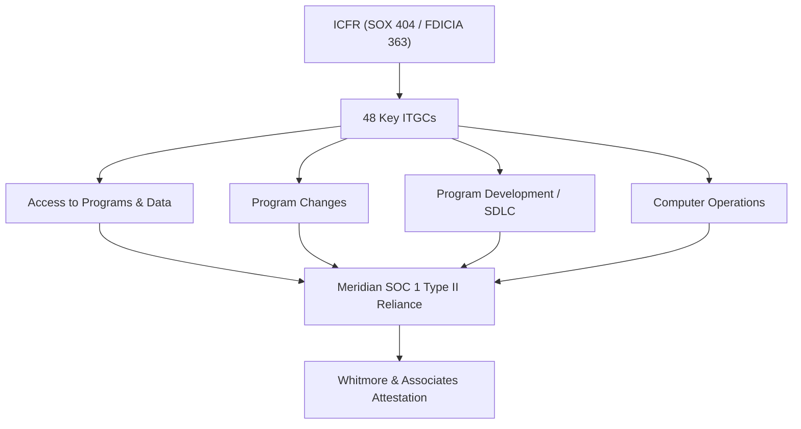
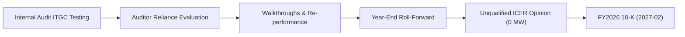

# 08.11 — SOX External Audit Support

| Field | Value |
|---|---|
| Document ID | CCB-SOX-SUP-2026-811 |
| Version | 1.0 |
| Date | 2026-06-15 |
| Classification | Confidential — Nonpublic Information (NPI) // Illustrative Portfolio Sample |
| Owner | Linda Barrett, Chief Financial Officer (CFO) |
| Author | Advisory Team (Financial-Services GRC) |
| Status | Approved |

## Purpose

This document describes how Cornerstone Community Bank supported the independent registered public accounting firm **Whitmore &amp; Associates, LLP** in performing its **SOX Section 404(b) attestation** over internal control over financial reporting (**ICFR**) for FY2026. Because Cornerstone Bancorp, Inc. is a **publicly traded SEC registrant (Nasdaq: CCBK)** and the Bank exceeds **$1 billion** in assets, both **SOX 404** and **FDICIA Part 363** apply. The document details how the external auditor **relied on Internal Audit's IT general control (ITGC) testing**, the walkthroughs performed, the evidence provided, and the timing of the engagement. The result was an **unqualified opinion on ICFR** with **0 material weaknesses**.

## Scope of ICFR / ITGC

The ITGC scope covers the **6 financially significant systems** (of 140 in the enterprise inventory) and **48 key IT general controls** across four domains. Meridian Core Services provides the outsourced core; reliance on Meridian's **SOC 1 Type II** report supports the outsourced portions of the control environment.

| ITGC Domain | Illustrative Control Focus | In-Scope Systems |
|---|---|---|
| Access to Programs &amp; Data | Provisioning, recertification, privileged access, segregation of duties | Core (Meridian), GL, loan systems |
| Program Changes | Change authorization, testing, approval, migration | Core, financial reporting apps |
| Program Development / SDLC | Project approval, testing, go-live acceptance | New/modified financial systems |
| Computer Operations | Job scheduling, backup/recovery, incident management | Core, infrastructure |

## External Auditor Reliance on Internal Audit

Under AS 2201, the external auditor may rely on the work of others (including Internal Audit) based on their competence and objectivity. Cornerstone's Internal Audit function — reporting functionally to the Audit Committee (Priya Sharma) — performed ITGC testing that Whitmore &amp; Associates evaluated and, where appropriate, relied upon to reduce duplicate testing.

| Reliance Element | How Supported | Auditor Assessment |
|---|---|---|
| Competence of Internal Audit | Qualified staff; documented methodology | Satisfactory for reliance |
| Objectivity / independence | Functional reporting to Audit Committee | Satisfactory for reliance |
| Quality of workpapers | Structured, cross-referenced ITGC workpapers | Adequate; relied upon in part |
| Re-performance sampling | Auditor re-performed a sample of relied-upon tests | Consistent results |

## Evidence and Walkthroughs Provided

Cornerstone provided the external auditor with control documentation, walkthroughs, and testing evidence for each ITGC domain. Walkthroughs confirmed control design; test-of-operating-effectiveness evidence supported the conclusion that controls operated throughout the period.

| Support Activity | Description | Provided By |
|---|---|---|
| Process walkthroughs | End-to-end walkthrough of each ITGC domain | IT Security / Internal Audit |
| Control matrices | 48-control matrix mapped to financial assertions | Internal Audit |
| Test evidence | Sample selections, screenshots, ticket records | IT Security team |
| SOC 1 reliance memo | Analysis of Meridian SOC 1 Type II + CUECs | CFO / Internal Audit |
| Deficiency remediation evidence | Closure artifacts for the 3 prior ITGC deficiencies | Marcus Doyle |

## Prior Deficiencies and Remediation Context

Phase 06 ITGC testing identified **3 deficiencies** (1 significant deficiency and 2 control deficiencies, with **0 material weaknesses**), all of which were **remediated** prior to year-end. The external auditor evaluated the remediation and confirmed it did not affect the overall ICFR conclusion.

| Deficiency Class | Count | Status | Effect on Opinion |
|---|---|---|---|
| Material weakness | 0 | N/A | None |
| Significant deficiency | 1 | Remediated | None (below aggregation threshold) |
| Control deficiency | 2 | Remediated | None |

## Engagement Timing

The SOX external audit followed a phased calendar aligned to the FY2026 10-K. Interim ITGC testing occurred alongside internal testing; final testing and roll-forward completed after year-end, culminating in the opinion filed with the 10-K.

| Milestone | Timing |
|---|---|
| ITGC design walkthroughs (interim) | 2026 Q3 |
| Internal ITGC operating-effectiveness testing | 2026-07 → 2026-09 |
| External reliance evaluation &amp; re-performance | 2026 Q4 |
| Roll-forward / year-end procedures | Early 2027 |
| ICFR opinion filed with FY2026 10-K | 2027-02 |

## Meridian SOC 1 Type II Reliance

Because the core is outsourced to Meridian Core Services, LLC, the control environment includes controls operated at the service organization. Cornerstone's reliance on Meridian's SOC 1 Type II report, together with complementary user-entity controls (CUECs), supports the outsourced portions of ICFR.

| Reliance Element | Cornerstone Action |
|---|---|
| SOC 1 Type II report review | Obtained current-period report; evaluated scope and period coverage |
| Complementary user-entity controls | Identified and confirmed operation of applicable CUECs |
| Gap / bridge-letter coverage | Obtained bridge letter for the gap between report date and year-end |
| Exceptions review | Reviewed noted exceptions; assessed no impact on ICFR conclusion |

## FDICIA Part 363 Alignment

As an institution with ≥$1B in assets, Cornerstone also satisfies FDICIA Part 363, which requires both a management assessment and an external attestation of ICFR. The SOX 404(b) work supports both requirements.

| Requirement | Source | Status |
|---|---|---|
| Management assessment of ICFR | SOX 404(a) / FDICIA 363 | Completed; ICFR effective |
| External auditor attestation | SOX 404(b) / FDICIA 363 | Unqualified opinion; 0 material weaknesses |
| Audit Committee oversight | FDICIA 363 | Active; results reported |

## Result

Whitmore &amp; Associates issued an **unqualified opinion on ICFR** for FY2026, concluding that internal control over financial reporting was **effective** with **0 material weaknesses**. This result, together with the management assessment required under FDICIA Part 363, completes the SOX assurance picture and complements the FFIEC IT examination Satisfactory outcome (08.10). All items feed the consolidated remediation tracker (08.12) and the phase summary (08.13).

## Cross-References

- `08.10-ffiec-it-examination-outcome.md` — FFIEC IT examination outcome
- `08.12-findings-remediation-tracker.md` — consolidated remediation tracker
- `../06-sox-itgc-fdicia/` — ITGC controls, testing, and deficiency remediation
- `../07-third-party-risk-business-continuity/` — Meridian SOC 1 reliance context
- `08.13-phase-summary-and-transition.md` — phase summary

[⬅ Previous](08.10-ffiec-it-examination-outcome.md) · [🏠 Phase README](08.00-README.md) · [Next ➡](08.12-findings-remediation-tracker.md)
