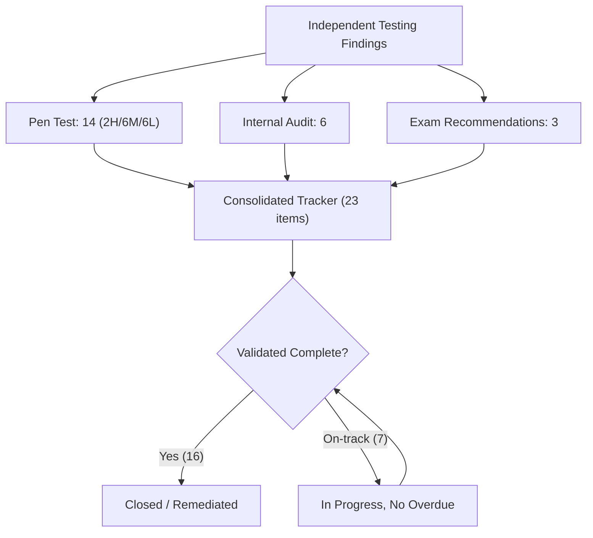
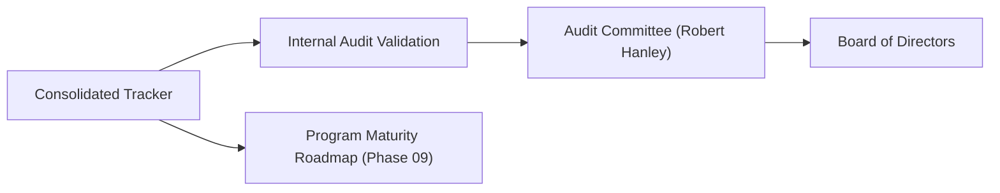

# 08.12 — Findings Remediation Tracker

| Field | Value |
|---|---|
| Document ID | CCB-EXAM-TRK-2026-812 |
| Version | 1.0 |
| Date | 2026-06-15 |
| Classification | Confidential — Nonpublic Information (NPI) // Illustrative Portfolio Sample |
| Owner | Priya Sharma, Director of Internal Audit |
| Author | Advisory Team (Financial-Services GRC) |
| Status | Approved |

## Purpose

This is the **consolidated, keystone remediation tracker** for all independent-testing findings raised during Phase 08. It unifies three sources into a single closed-loop view for the Audit Committee and examiners: the **Redwood Security Partners penetration test (14 findings: 2 High, 6 Medium, 6 Low)**, the **Internal Audit recommendations (6 items, all Medium or lower)**, and the **FFIEC IT examination minor recommendations (3 items)**. Every pen test finding is **remediated**; audit and exam recommendations are **remediated or on-track** with committed owners and dates and **no overdue items**. This single tracker demonstrates the disciplined issue-management process the FFIEC IT Handbook (Audit booklet) expects.

## Consolidated Summary

| Source | Items | Remediated / Closed | On-Track (In Progress) | Overdue |
|---|---|---|---|---|
| Penetration test (Redwood) | 14 | 14 | 0 | 0 |
| Internal audit recommendations | 6 | 2 | 4 | 0 |
| FFIEC exam recommendations | 3 | 0 | 3 | 0 |
| **Total** | **23** | **16** | **7** | **0** |

## Penetration Test Findings (Redwood Security Partners)

All 14 pen test findings were remediated and closure-verified (see 08.05). None remained open at year-end.

| ID | Severity | Finding (summary) | Owner | Target | Status |
|---|---|---|---|---|---|
| PEN-01 | High | External service exposed with weak TLS configuration | Marcus Doyle | 2026-10-31 | Remediated |
| PEN-02 | High | Privilege-escalation path via over-permissioned service account | IT Security team | 2026-10-31 | Remediated |
| PEN-03 | Medium | Missing MFA on a secondary administrative interface | Marcus Doyle | 2026-11-15 | Remediated |
| PEN-04 | Medium | Unpatched middleware component (known CVE) | IT Security team | 2026-11-15 | Remediated |
| PEN-05 | Medium | Verbose error messages disclosing stack details | App team | 2026-11-15 | Remediated |
| PEN-06 | Medium | Weak password policy on a legacy internal app | Marcus Doyle | 2026-11-15 | Remediated |
| PEN-07 | Medium | Insufficient session-timeout on internal portal | App team | 2026-11-15 | Remediated |
| PEN-08 | Medium | Directory listing enabled on a web server | IT Security team | 2026-11-15 | Remediated |
| PEN-09 | Low | Missing security headers on a public web page | App team | 2026-11-30 | Remediated |
| PEN-10 | Low | Outdated TLS cipher suites still enabled | IT Security team | 2026-11-30 | Remediated |
| PEN-11 | Low | Informational banner disclosing software version | IT Security team | 2026-11-30 | Remediated |
| PEN-12 | Low | Non-critical logging gap on an internal host | Marcus Doyle | 2026-11-30 | Remediated |
| PEN-13 | Low | Cookie missing Secure attribute on a low-risk app | App team | 2026-11-30 | Remediated |
| PEN-14 | Low | Minor rate-limiting gap on a non-authenticated endpoint | App team | 2026-11-30 | Remediated |

## Internal Audit Recommendations

Internal Audit's six recommendations (08.07) are tracked here. All are Medium or lower with committed dates; none is overdue.

| ID | Rating | Recommendation (summary) | Owner | Target | Status |
|---|---|---|---|---|---|
| IA-2026-01 | Medium | Automate recertification reminders and escalation | Marcus Doyle | 2026-12-31 | In progress |
| IA-2026-02 | Medium | Standardize vendor-file completeness checklist | Karen Ellis / Vendor Mgmt | 2026-12-15 | In progress |
| IA-2026-03 | Medium | Centralize remediation closure evidence | Marcus Doyle | 2026-12-31 | In progress |
| IA-2026-04 | Low | Document owners for all service accounts | IT Security team | 2026-11-30 | Closed |
| IA-2026-05 | Low | Tighten awareness-completion tracking/escalation | Rachel Alvarez | 2026-12-31 | In progress |
| IA-2026-06 | Observation | Reinforce branch visitor-log retention procedure | Branch Operations | 2026-12-15 | Closed |

## FFIEC Examination Recommendations

The examination produced only minor recommendations (08.10); each is accepted and tracked. They reinforce existing audit themes and the CSF 2.0 maturity roadmap.

| ID | Recommendation (summary) | Owner | Target | Status |
|---|---|---|---|---|
| EXAM-REC-01 | Continue tightening periodic access recertification timeliness | Marcus Doyle | 2026-12-31 | On-track |
| EXAM-REC-02 | Formalize centralized remediation-closure evidence retention | Marcus Doyle | 2026-12-31 | On-track |
| EXAM-REC-03 | Advance selected NIST CSF 2.0 domains toward Intermediate target | Rachel Alvarez | 2027 cycle | On-track |

## Root-Cause Themes and Systemic Actions

Cross-source themes are addressed systemically rather than item-by-item, demonstrating durable control improvement to examiners and the Audit Committee.

| Theme | Related Items | Systemic Corrective Action |
|---|---|---|
| Timeliness of periodic reviews | IA-2026-01, IA-2026-05, EXAM-REC-01 | Automated reminders, escalation, manager accountability |
| Evidence / documentation retention | IA-2026-02, IA-2026-03, IA-2026-06, EXAM-REC-02 | Standardized checklists; mandatory closure artifacts in tracker |
| Technical hardening | PEN-01 → PEN-14 | Configuration baselines, patch SLAs, MFA and header standards |
| Maturity advancement | EXAM-REC-03 | CSF 2.0 roadmap toward Intermediate target profile (Phase 09) |

## Severity and Aging View

No item is overdue. The table below shows aging against target dates as of the tracking cycle, confirming disciplined, on-schedule remediation.

| Bucket | Items | Overdue | Notes |
|---|---|---|---|
| Closed / Remediated | 16 | 0 | Validated or verified complete |
| Due within 30 days | 4 | 0 | On-track; committed 2026 dates |
| Due beyond 30 days | 3 | 0 | Includes 2027-cycle maturity item |
| **Total** | **23** | **0** | No critical or overdue items |

## Reporting Cadence

The consolidated tracker is a standing item in issue-management reporting so status remains transparent to management and the Audit Committee through closure.

| Audience | Frequency | Content |
|---|---|---|
| CISO / Management | Monthly | Full tracker, owner accountability |
| Audit Committee | Quarterly | Status roll-up, overdue exceptions (none) |
| Board of Directors | With annual GLBA report | Summary of independent-testing results |

## Governance and Validation

Internal Audit retains responsibility for independent validation of closure. All 14 pen test items are validated closed; the remaining audit and exam items are on-track with no overdue items and will be validated on their committed dates. The tracker is reported to the Audit Committee and carried into Phase 09 as an input to program-maturity monitoring. None of the open items constitutes a significant deficiency or material weakness, and none alters the Satisfactory examination outcome or the unqualified ICFR opinion.

## Cross-References

- `08.05-pentest-remediation.md` — pen test remediation detail
- `08.07-internal-audit-findings-and-response.md` — internal audit findings
- `08.10-ffiec-it-examination-outcome.md` — exam recommendations source
- `08.11-sox-external-audit-support.md` — SOX ITGC context
- `08.13-phase-summary-and-transition.md` — phase summary
- `../09-board-reporting-program-maturity/` — maturity roadmap

[⬅ Previous](08.11-sox-external-audit-support.md) · [🏠 Phase README](08.00-README.md) · [Next ➡](08.13-phase-summary-and-transition.md)
