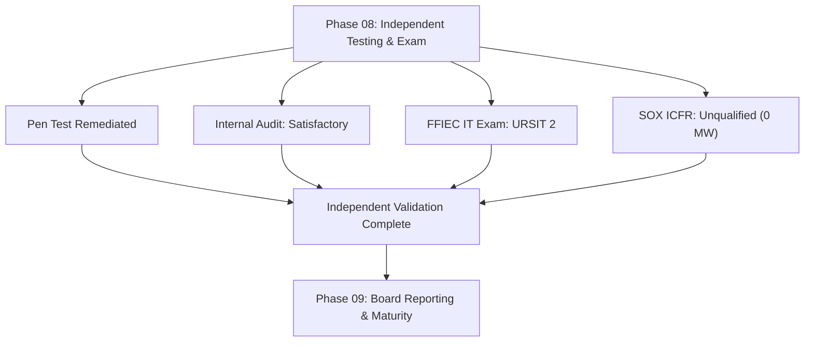
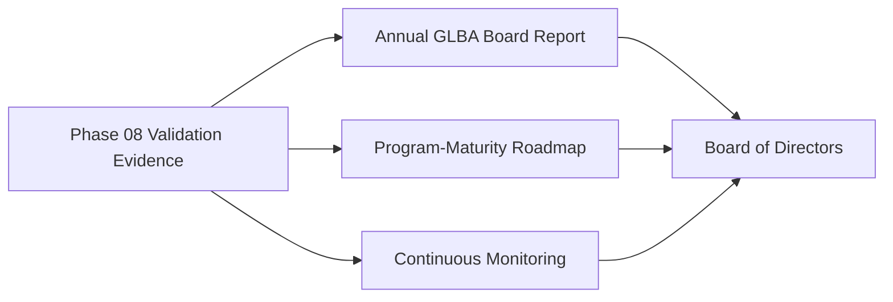

# 08.13 — Phase Summary &amp; Transition

| Field | Value |
|---|---|
| Document ID | CCB-EXAM-SUM-2026-813 |
| Version | 1.0 |
| Date | 2026-06-15 |
| Classification | Confidential — Nonpublic Information (NPI) // Illustrative Portfolio Sample |
| Owner | Rachel Alvarez, Chief Information Security Officer (CISO) |
| Author | Advisory Team (Financial-Services GRC) |
| Status | Approved |

## Purpose

This document summarizes **Phase 08 — Independent Testing, Audit &amp; Examination Readiness** and transitions the program to **Phase 09 — Board Reporting, Program Maturity &amp; Continuous Improvement**. Phase 08 completed the **independent validation** layer of Cornerstone Community Bank's GLBA/FFIEC/SOX program: an external penetration test fully remediated, a Satisfactory internal audit, a **Satisfactory FFIEC IT examination (URSIT composite "2")**, and an **unqualified SOX ICFR opinion (0 material weaknesses)**. Together these results confirm the program is **well-managed** with a **Low-to-Moderate residual posture**, and provide the evidence base for the annual GLBA Board report in Phase 09.

## Phase 08 Outcomes at a Glance

| Workstream | Result | Reference |
|---|---|---|
| Penetration test (Redwood) | 14 findings (2H/6M/6L) — all remediated | 08.03–08.05 |
| Vulnerability assessment | Remediated; feeds hardening baselines | 08.04 |
| Internal audit of infosec program | Satisfactory with recommendations | 08.06–08.07 |
| FFIEC IT examination | **Satisfactory — URSIT composite "2"** (report 2026-12-15) | 08.10 |
| SOX 404(b) external attestation | **Unqualified ICFR opinion; 0 material weaknesses** | 08.11 |
| Consolidated remediation | 23 items; 16 closed, 7 on-track, 0 overdue | 08.12 |

## Independent Validation Narrative

Phase 08 subjected the program built in Phases 01–07 to four independent lenses — technical (pen test), internal (audit), supervisory (FFIEC examination), and financial-control (SOX external audit). No lens identified a critical weakness, a Matter Requiring Attention, or a material weakness. The convergence of these independent results is the strongest available evidence that the GLBA §501(b) safeguards — risk assessment, WISP, board oversight, service-provider oversight, and adjust-and-report — are effective in operation, not merely on paper.

| Validation Lens | Independent Party | Conclusion |
|---|---|---|
| Technical exploitability | Redwood Security Partners, LLC | All 14 findings remediated |
| Internal control review | Internal Audit (Priya Sharma) | Satisfactory with recommendations |
| Supervisory examination | FDIC + Ohio DFI | Satisfactory (URSIT composite "2") |
| ICFR attestation | Whitmore &amp; Associates, LLP | Unqualified; 0 material weaknesses |

## Residual Posture

Consistent with the program storyline, the Bank's residual posture is assessed **Low-to-Moderate and well-managed**. Open remediation items are minor operating-discipline enhancements with committed owners and dates and no overdue items.

| Dimension | Status |
|---|---|
| Inherent risk profile | Moderate |
| Control effectiveness | Effective (validated by four independent lenses) |
| Residual risk | Low-to-Moderate |
| Open findings | 7 on-track, 0 overdue, 0 critical |
| Regulatory standing | Satisfactory; no supervisory action |

## Open Items Carried Into Phase 09

The seven on-track items from the consolidated tracker (08.12) are carried into Phase 09 for continued monitoring and closure validation. None affects the program's ratings or opinions.

| Carried Item | Owner | Target |
|---|---|---|
| Recertification automation (IA-2026-01 / EXAM-REC-01) | Marcus Doyle | 2026-12-31 |
| Vendor-file checklist (IA-2026-02) | Karen Ellis / Vendor Mgmt | 2026-12-15 |
| Centralized closure evidence (IA-2026-03 / EXAM-REC-02) | Marcus Doyle | 2026-12-31 |
| Awareness-completion tracking (IA-2026-05) | Rachel Alvarez | 2026-12-31 |
| NIST CSF 2.0 maturity advancement (EXAM-REC-03) | Rachel Alvarez | 2027 cycle |

## Program Storyline Consistency Check

Phase 08 results align with the master program storyline, keeping every headline number consistent across the portfolio.

| Storyline Element | Recorded Value | Phase 08 Confirmation |
|---|---|---|
| Pen test findings | 14 (2H/6M/6L) | All remediated (08.05/08.12) |
| Internal audit opinion | Satisfactory with recommendations | Confirmed (08.06/08.07) |
| FFIEC IT exam | Satisfactory — URSIT composite "2" | Confirmed (08.10) |
| SOX ICFR | Effective; unqualified; 0 material weaknesses | Confirmed (08.11) |
| Residual posture | Low-to-Moderate, well-managed | Confirmed (this doc) |

## Lessons Learned

| Theme | Lesson | Forward Action |
|---|---|---|
| Evidence discipline | Pre-indexed evidence minimized examiner follow-up | Maintain living evidence index |
| Operating timeliness | Periodic reviews benefit from automation | Complete recertification automation |
| Maturity trajectory | CSF 2.0 target profile drives prioritization | Advance domains in Phase 09 |

## Transition to Phase 09

Phase 09 converts Phase 08's validation results into **board-level reporting and continuous program maturity**. Key hand-off inputs include the FFIEC Satisfactory outcome, the unqualified SOX opinion, the consolidated remediation tracker, and the NIST CSF 2.0 target-profile roadmap (current baseline "Evolving/Baseline" → target "Intermediate," 28 gaps).

| Phase 09 Objective | Phase 08 Input |
|---|---|
| Annual GLBA report to the Board (2027-01) | All Phase 08 validation results |
| SOX opinion communication (FY2026 10-K, 2027-02) | 08.11 unqualified ICFR opinion |
| Program-maturity roadmap | 08.10 / 08.12 CSF 2.0 recommendations |
| Continuous-improvement monitoring | 08.12 consolidated tracker |

## Cross-References

- `08.10-ffiec-it-examination-outcome.md` — FFIEC IT examination outcome
- `08.11-sox-external-audit-support.md` — SOX external audit support
- `08.12-findings-remediation-tracker.md` — consolidated remediation tracker
- `08.01-independent-testing-strategy.md` — testing portfolio overview
- `../09-board-reporting-program-maturity/09.00-README.md` — next phase
- `../03-risk-assessment/` — residual-risk baseline

[⬅ Previous](08.12-findings-remediation-tracker.md) · [🏠 Phase README](08.00-README.md) · [Next ➡](../09-board-reporting-program-maturity/09.00-README.md)
