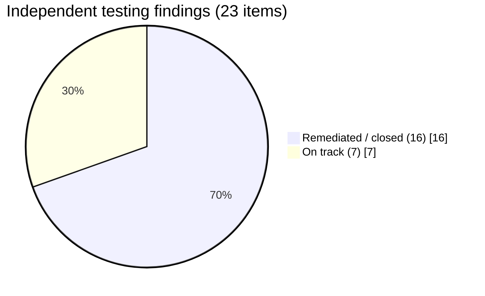

# Diagram — Findings Remediation

| Field | Value |
|---|---|
| Version | 1.0 |
| Date | 2026-06-15 |
| Classification | Confidential — Nonpublic Information (NPI) // Illustrative Portfolio Sample |
| Institution | Cornerstone Community Bank (parent: Cornerstone Bancorp, Inc. — Nasdaq: CCBK) |
| Regulators | FDIC · Ohio DFI · SEC |
| Phase | 08 — Independent Testing, Audit & Exam Readiness |
| Author | Advisory Team (Financial-Services GRC) |
| Status | Approved |

Pen test: 14 findings **all remediated**. Internal audit + exam recommendations tracked to closure; **0 overdue**.

## Cross-References
`08.12-findings-remediation-tracker.md`.
