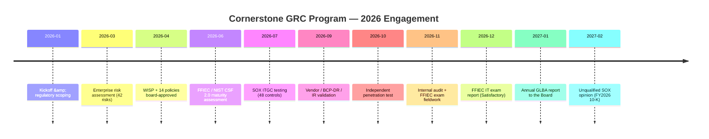

# 09.01 — Executive Summary

| Field | Value |
|---|---|
| Document ID | CCB-EXEC-SUM-2026-901 |
| Version | 1.0 |
| Date | 2026-06-15 |
| Classification | Confidential — Nonpublic Information (NPI) // Illustrative Portfolio Sample |
| Owner | Rachel Alvarez, Chief Information Security Officer (CISO) |
| Author | Advisory Team (Financial-Services GRC) |
| Status | Approved |

## Purpose

This Executive Summary presents, in a single board-ready view, the outcome of Cornerstone Community Bank's ("Cornerstone," "the Bank") twelve-month Information Security & GRC program. It is written for the **Board of Directors, the Audit Committee, and executive management** of the Bank and its publicly traded parent, **Cornerstone Bancorp, Inc.** (Nasdaq: CCBK). It rolls up the nine program phases — from regulatory scoping through independent examination — into the conclusions the Board must be able to state and defend: that the Bank maintains a compliant, risk-appropriate information security program under GLBA §501(b); that its internal control over financial reporting (ICFR) is effective; and that residual risk is well-managed.

The detailed evidence sits in the phase deliverables cross-referenced throughout this phase. This document is the on-ramp to the statutory **Annual GLBA Board Report (09.02)** and the supporting dashboards (09.03–09.06).

## The Program in One View

Cornerstone built and validated a full-scope information security and regulatory-compliance program aligned to the **Interagency Guidelines Establishing Information Security Standards** (the GLBA "Safeguards" requirement), the **FFIEC IT Examination Handbook**, **NIST CSF 2.0**, and — because the parent is an SEC registrant with ≥ $1B in assets — **SOX Section 404** and **FDICIA Part 363**. The program protects customer **nonpublic personal information (NPI)** residing across 22 systems within a 140-system enterprise inventory, of which 6 are financially significant.

| Dimension | Result | Reference |
|---|---|---|
| Enterprise risk assessment | 42 risks identified (8 High / 18 Moderate / 16 Low); overall **Moderate** inherent risk | Phase 03 |
| Written program & policy | **WISP + 14 core policies** board-approved; administrative, technical, physical safeguards | Phase 04 |
| Cyber maturity (NIST CSF 2.0) | Current **Evolving** → target **Intermediate**; **28 gaps** with funded roadmap | Phase 05 |
| SOX ITGC / FDICIA | **48 key ITGCs**; 3 deficiencies (0 material weaknesses) all remediated; **ICFR effective** | Phase 06 |
| Third-party & resilience | **85 vendors / 12 critical**; Meridian under enhanced oversight; BCP/DR tested; IR plan + tabletop | Phase 07 |
| Independent testing | Pen test **14 findings** (2 High / 6 Med / 6 Low) **all remediated**; internal audit **Satisfactory** | Phase 08 |
| Regulatory examination | **FFIEC IT exam: Satisfactory (URSIT composite "2")** | Phase 08 |
| External SOX opinion | **Unqualified** ICFR opinion (FY2026 404(b)); 0 material weaknesses | Phase 08 |
| Residual risk posture | **Low-to-Moderate**, well-managed | Phase 09 |

## Headline Outcomes for the Board

The Board can take assurance from four independently corroborated outcomes:

1. **A satisfactory regulatory examination.** The FFIEC IT examination concluded **Satisfactory with a URSIT composite rating of "2,"** confirming that management practices, technology risk, and controls are sound and that identified weaknesses are within management's ability to correct in the normal course.
2. **A clean financial-control opinion.** The independent registered public accounting firm (Whitmore & Associates, LLP) issued an **unqualified opinion** on ICFR for FY2026 with **zero material weaknesses**; the three ITGC deficiencies identified during testing were remediated and re-tested.
3. **Every High risk is treated.** All **8 High** enterprise risks carry an approved treatment plan and reduced residual rating; no High residual risk is accepted without documented, time-bound remediation.
4. **A maturing, funded program.** The program advanced from inception to an **Evolving** NIST CSF 2.0 baseline with a Board-endorsed roadmap to **Intermediate**, supported by an illustrative annual program budget of approximately **$1.4M** (illustrative figure for this portfolio sample).

## Program Timeline

## What Was Built Across the Nine Phases

| Phase | Focus | Keystone Deliverable |
|---|---|---|
| 01 | Program foundation & regulatory scoping | Regulatory register; program charter; ADR baseline |
| 02 | Asset inventory & data classification | 140-system inventory; NPI classification (22 NPI systems) |
| 03 | Risk assessment (GLBA 501(b)) | 42-risk register; Moderate inherent profile |
| 04 | Information security program & controls | WISP + 14 policies; safeguards catalog |
| 05 | FFIEC / NIST CSF 2.0 maturity | Current vs target profile; 28-gap roadmap |
| 06 | SOX ITGC & FDICIA | 48 ITGCs tested; ICFR effective |
| 07 | Third-party risk & business continuity | 85-vendor register; BCP/DR + IR validated |
| 08 | Independent testing, audit & exam | Pen test, internal audit, FFIEC exam, SOX support |
| 09 | Board reporting & program maturity | This capstone reporting suite |

## Independent Assurance Stack

The Board should note that the program's conclusions do not rest on management self-assertion alone. Four independent parties tested the program during the year, and their conclusions converge.

| Assurance Provider | Role | Conclusion |
|---|---|---|
| FDIC / Ohio DFI | FFIEC IT examination | Satisfactory — URSIT composite "2" |
| Whitmore & Associates, LLP | External SOX 404(b) / ICFR audit | Unqualified; 0 material weaknesses |
| Redwood Security Partners, LLC | Independent penetration testing | 14 findings — all remediated |
| Internal Audit (Priya Sharma) | Independent program review | Satisfactory with recommendations |

## Residual Risk & Forward Posture

After treatment, the Bank's enterprise residual posture is **Low-to-Moderate**. The most significant residual exposures — third-party concentration on Meridian Core Services, digital-banking fraud/account-takeover, and the pace of closing the remaining CSF 2.0 maturity gaps — are actively managed with named owners and are reported in the risk heat map (09.06) and KPI/KRI scorecard (09.05). No condition rises to the level of a reportable material weakness or an unmanaged High residual risk.

## Recommendation to the Board

Management recommends the Board **acknowledge the state of the information security program as satisfactory and effective**, approve the continued funding of the CSF 2.0 roadmap to Intermediate maturity, and receive the Annual GLBA Board Report (09.02) as its formal §501(b) annual reporting for the period.

## Board Actions Requested

| # | Action | Reference |
|---|---|---|
| 1 | Acknowledge receipt of the Annual GLBA Board Report | 09.02 |
| 2 | Affirm the program is satisfactory and effective for the period | This document |
| 3 | Approve continued funding of the CSF 2.0 roadmap to Intermediate | 09.04 |
| 4 | Accept the Low-to-Moderate residual risk posture as within appetite | 09.06 |
| 5 | Endorse the continuous-improvement and monitoring plan | 09.05 |

## Cross-References

- `09.02-annual-glba-board-report.md` — statutory §501(b) annual board report
- `09.03-compliance-posture-dashboard.md` — obligation-set RAG dashboard
- `09.04-program-maturity-assessment.md` — NIST CSF 2.0 maturity scoring
- `09.05-kpi-and-kri-scorecard.md` — executive KPI/KRI scorecard
- `09.06-risk-posture-and-heat-map.md` — residual risk heat map
- `../08-independent-testing-audit-exam-readiness/08.10-ffiec-it-examination-outcome.md` — FFIEC exam result
- `../08-independent-testing-audit-exam-readiness/08.11-sox-external-audit-support.md` — SOX opinion
- `../03-risk-assessment/` — enterprise risk baseline

[⬅ Previous](09.00-README.md) · [🏠 Phase README](09.00-README.md) · [Next ➡](09.02-annual-glba-board-report.md)
