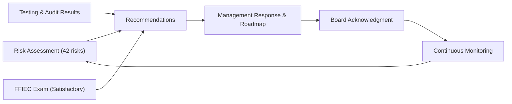

# 09.02 — Annual GLBA Board Report

| Field | Value |
|---|---|
| Document ID | CCB-EXEC-GLBA-2026-902 |
| Version | 1.0 |
| Date | 2026-06-15 |
| Classification | Confidential — Nonpublic Information (NPI) // Illustrative Portfolio Sample |
| Owner | Rachel Alvarez, Chief Information Security Officer (CISO) |
| Author | Advisory Team (Financial-Services GRC) |
| Status | Approved |

## Purpose

This document is the **annual written report to the Board of Directors** required by the **Gramm-Leach-Bliley Act (GLBA) §501(b)** and the **Interagency Guidelines Establishing Information Security Standards** (Section III.F). The Interagency Guidelines require that the Bank "report to its board or an appropriate committee of the board at least annually" describing the overall status of the information security program and the Bank's compliance with the Guidelines, and specifically addressing material matters relating to: **risk assessment; risk management and control decisions; service-provider arrangements; results of testing; security breaches or violations and management's responses; and recommendations for changes to the program.**

This is a **keystone governance deliverable**. It is presented to the Board / Audit Committee of Cornerstone Community Bank and is retained as evidence of Board oversight for the FFIEC IT examination and the Bank's regulators (Ohio DFI and FDIC).

## Reporting Period & Scope

| Item | Detail |
|---|---|
| Reporting period | Program year 2026 (engagement 2026-01-12 through examination close 2026-12-15) |
| Statutory basis | GLBA §501(b); Interagency Guidelines III.F (annual report to the board) |
| Program owner | Rachel Alvarez, CISO / Information Security Officer |
| Governance body | Board of Directors / Audit Committee (Robert Hanley, Chair) |
| Scope of protection | Customer NPI across 22 systems within the 140-system enterprise inventory |

## 1. Overall Status of the Information Security Program

The Bank maintains a **written information security program (WISP)** supported by **14 board-approved core policies** spanning administrative, technical, and physical safeguards. The program is designed to ensure the security and confidentiality of customer NPI, protect against anticipated threats, and protect against unauthorized access or use that could result in substantial harm or inconvenience to any customer — the three GLBA §501(b) objectives.

Management's assessment for the period is that the program is **operating effectively and is appropriate to the size, complexity, and risk profile of the Bank.** Independent validation supports this conclusion: the **FFIEC IT examination concluded Satisfactory (URSIT composite "2")**, internal audit rated the program **Satisfactory with recommendations**, and the external SOX 404(b) opinion on ICFR was **unqualified with zero material weaknesses**.

| Program Element | Status | Basis |
|---|---|---|
| Written program (WISP) & 14 policies | In place, board-approved | Phase 04 |
| Board & senior-management oversight | Active; annual report delivered (this document) | Interagency Guidelines III.F |
| Risk assessment | Completed & current (42 risks) | Phase 03 |
| Safeguards (admin/technical/physical) | Implemented & tested | Phases 04, 08 |
| Service-provider oversight | Active; Meridian under enhanced oversight | Phase 07 |
| Independent testing | Completed; all findings remediated | Phase 08 |
| Adjust-and-report | This annual report + continuous monitoring | Phase 09 |

## 2. Risk Assessment Results

The enterprise risk assessment (NIST SP 800-30 methodology) identified **42 risks**, rated **8 High, 18 Moderate, and 16 Low**, yielding an **overall Moderate inherent risk profile**. All **8 High** risks carry approved, time-bound treatment plans; after treatment, no High residual risk is accepted without documented remediation. The Bank's post-treatment **residual posture is Low-to-Moderate**.

| Inherent Rating | Count | Treatment Status | Residual Direction |
|---|---|---|---|
| High | 8 | Treatment plans approved & underway | Reduced to Moderate or below |
| Moderate | 18 | Mitigated / monitored | Stable to reduced |
| Low | 16 | Accepted with monitoring | Stable |
| **Total** | **42** | — | **Low-to-Moderate residual** |

## 3. Service-Provider (Third-Party) Oversight

The Bank manages a portfolio of **85 third parties**, of which **12 are critical/high-risk**. Core banking and digital banking are **outsourced to Meridian Core Services, LLC**, which is subject to **enhanced ongoing oversight**. Assurance over Meridian is obtained through its independent **SOC 1 Type II and SOC 2 Type II** reports, validation of complementary user entity controls (CUECs), and contractual right-to-audit and incident-notification provisions consistent with the **Interagency Guidance on Third-Party Relationships (2023)**.

| Oversight Activity | Status |
|---|---|
| Critical-vendor risk reviews current | Yes — 12/12 critical vendors reviewed within cycle |
| Meridian SOC 1 / SOC 2 Type II reviewed | Yes — no exceptions material to the Bank |
| CUECs validated | Yes — Phase 07 |
| Contractual incident-notification & right-to-audit | In place for critical vendors |
| Concentration risk (Meridian core dependency) | Identified; monitored as a top residual risk |

## 4. Results of Testing

The Bank completed its required independent testing of key controls. The external penetration test (Redwood Security Partners) produced **14 findings (2 High, 6 Medium, 6 Low) — all remediated and re-validated.** Internal audit's independent review of the information security program concluded **Satisfactory with recommendations**. Business continuity and disaster recovery plans were **exercised and met RTO/RPO objectives**, and the incident response plan was validated through a **tabletop exercise**.

| Test | Provider | Result |
|---|---|---|
| External penetration test | Redwood Security Partners, LLC | 14 findings — all remediated |
| Vulnerability assessment | Redwood + internal tooling | Findings remediated per SLA |
| Internal audit of InfoSec program | Internal Audit (Priya Sharma) | Satisfactory with recommendations |
| BCP / DR exercise | Business Continuity function | RTO/RPO met |
| Incident response tabletop | CISO / IR team | Plan validated; lessons captured |
| FFIEC IT examination | FDIC / Ohio DFI | **Satisfactory — URSIT composite "2"** |

## 5. Security Incidents & Violations

During the reporting period the Bank experienced **no material security breach and no "notification incident"** triggering the **36-hour Computer-Security Incident Notification Rule**. A small number of **minor, contained events** (e.g., isolated phishing attempts and routine malware detections) were handled within normal operations with no confirmed unauthorized access to customer NPI and no customer harm. No regulatory notification was required.

## 6. Recommendations & Management's Response

| # | Recommendation | Management Response |
|---|---|---|
| R-1 | Continue funding the NIST CSF 2.0 roadmap from Evolving to Intermediate (28 gaps) | Accepted; roadmap funded in illustrative ~$1.4M program budget |
| R-2 | Sustain enhanced Meridian oversight and monitor core-provider concentration | Accepted; enhanced oversight retained; concentration tracked as top residual risk |
| R-3 | Maintain phishing-resistant MFA expansion and reduce phishing-sim fail rate | Accepted; MFA coverage and awareness targets in KPI scorecard (09.05) |
| R-4 | Continue annual independent testing cadence and prompt remediation | Accepted; annual pen test + quarterly VA retained |
| R-5 | Advance internal-audit recommendations to closure | Accepted; tracked to completion in remediation tracker |

## 7. Board Acknowledgment & Sign-Off

The Board of Directors (or its Audit Committee) acknowledges receipt of this annual report, its review of the overall status of the information security program, and its concurrence with management's risk-management and control decisions for the period.

| Role | Name | Acknowledgment | Date |
|---|---|---|---|
| Audit Committee Chair | Robert Hanley | ______________________ | __________ |
| President, Cornerstone Community Bank | David Okonkwo | ______________________ | __________ |
| Chief Information Security Officer | Rachel Alvarez | ______________________ | __________ |
| Chief Risk Officer | Steven Nakamura | ______________________ | __________ |

*The Board's acknowledgment of this report is recorded in the minutes of the meeting at which it is presented and is retained as evidence of Board oversight under the Interagency Guidelines III.F.*

## Cross-References

- `09.01-executive-summary.md` — one-page program summary
- `09.03-compliance-posture-dashboard.md` — obligation RAG status
- `09.06-risk-posture-and-heat-map.md` — residual risk detail
- `../03-risk-assessment/` — 42-risk assessment
- `../07-third-party-risk-business-continuity/` — Meridian oversight
- `../08-independent-testing-audit-exam-readiness/08.10-ffiec-it-examination-outcome.md` — FFIEC outcome

[⬅ Previous](09.01-executive-summary.md) · [🏠 Phase README](09.00-README.md) · [Next ➡](09.03-compliance-posture-dashboard.md)
