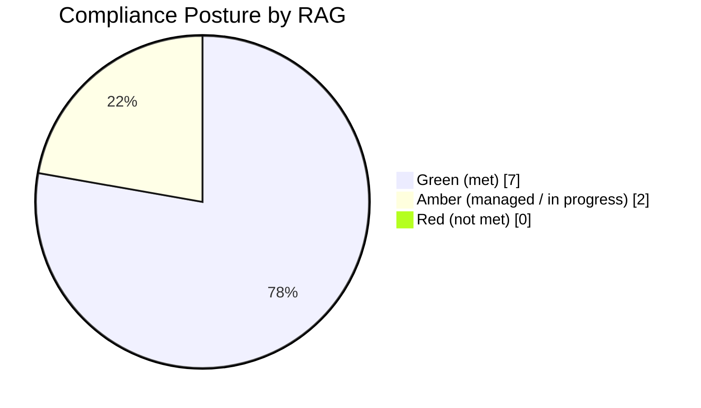

# 09.03 — Compliance Posture Dashboard

| Field | Value |
|---|---|
| Document ID | CCB-EXEC-DASH-2026-903 |
| Version | 1.0 |
| Date | 2026-06-15 |
| Classification | Confidential — Nonpublic Information (NPI) // Illustrative Portfolio Sample |
| Owner | Rachel Alvarez, Chief Information Security Officer (CISO) |
| Author | Advisory Team (Financial-Services GRC) |
| Status | Approved |

## Purpose

This dashboard gives the Board and executive management a **Red / Amber / Green (RAG)** view of Cornerstone Community Bank's compliance posture across its full regulatory obligation set. It consolidates the conclusions of the nine program phases into a single scannable status page so that the Board can confirm — at a glance and with evidence links — that each obligation is being met and can see where residual attention is directed. It supports the Annual GLBA Board Report (09.02) and is the compliance-facing companion to the risk heat map (09.06).

## RAG Legend

| Rating | Meaning |
|---|---|
| 🟢 Green | Obligation met; controls effective; no significant open items |
| 🟡 Amber | Substantially met; minor open items or improvement in progress; managed |
| 🔴 Red | Not met; significant gap or unmanaged exposure (none currently) |

## Compliance Posture — Obligation Set

| # | Obligation / Framework | Status | Basis & Notes |
|---|---|---|---|
| 1 | **GLBA Safeguards** (§501(b) / Interagency Guidelines) | 🟢 Green | WISP + 14 policies; annual board report delivered; safeguards tested |
| 2 | **GLBA Privacy / Regulation P** | 🟢 Green | Privacy notices current; NPI-sharing controls in place (Karen Ellis, Privacy Officer) |
| 3 | **FFIEC IT Examination** | 🟢 Green | **Satisfactory — URSIT composite "2"** (report 2026-12-15) |
| 4 | **NIST CSF 2.0 Maturity** | 🟡 Amber | Current **Evolving** → target **Intermediate**; 28 gaps on funded roadmap |
| 5 | **SOX 404 ITGC** | 🟢 Green | 48 ITGCs; 3 deficiencies remediated; 0 material weaknesses; ICFR effective |
| 6 | **FDICIA Part 363** | 🟢 Green | Management + external ICFR attestation complete; unqualified 404(b) opinion |
| 7 | **36-Hour Incident Notification Rule** | 🟢 Green | Procedure in place; no notification incident in period |
| 8 | **Third-Party / Vendor Management** | 🟡 Amber | 85 vendors / 12 critical reviewed; Meridian concentration monitored |
| 9 | **BCP / DR** | 🟢 Green | Plans tested; RTO/RPO met; IR plan + tabletop validated |

## Posture Distribution

The obligation set is predominantly Green, with two Amber items reflecting active, funded improvement rather than deficiency, and no Red items.

## Detail — Amber Items (Where Attention Is Directed)

| Obligation | Why Amber | Action & Owner | Target |
|---|---|---|---|
| NIST CSF 2.0 Maturity | Baseline is Evolving; 28 maturity gaps remain open on the roadmap | Execute funded roadmap; quarterly maturity re-scoring — Rachel Alvarez (CISO) | Intermediate |
| Third-Party / Vendor Management | Core-provider concentration on Meridian is a structural exposure | Enhanced oversight; SOC report review; concentration monitoring — Steven Nakamura (CRO) | Sustained managed state |

## Authoritative Basis for Each Obligation

For audit traceability, each obligation maps to a specific authority and to the accountable officer.

| Obligation | Authority | Accountable Officer |
|---|---|---|
| GLBA Safeguards | GLBA §501(b); Interagency Guidelines III | Rachel Alvarez (CISO/ISO) |
| GLBA Privacy / Reg P | GLBA Privacy Rule / Regulation P | Karen Ellis (Privacy Officer) |
| FFIEC IT Examination | FFIEC IT Examination Handbook | Rachel Alvarez / David Okonkwo |
| NIST CSF 2.0 Maturity | NIST CSF 2.0 (6 Functions) | Rachel Alvarez (CISO) |
| SOX 404 ITGC | Sarbanes-Oxley Act §404 | Linda Barrett (CFO) |
| FDICIA Part 363 | FDICIA §36 / Part 363 (≥$1B) | Linda Barrett (CFO) |
| 36-Hour Notification | Computer-Security Incident Notification Rule (2022) | Rachel Alvarez (CISO) |
| Third-Party / Vendor | Interagency Guidance on Third-Party Relationships (2023) | Steven Nakamura (CRO) |
| BCP / DR | FFIEC Business Continuity Management booklet | James Porter (CIO) |

## Monitoring Cadence

The dashboard is not a point-in-time snapshot; each obligation is monitored on a defined cadence and refreshed for the Board.

| Cadence | Obligations Reviewed |
|---|---|
| Continuous | Incident/36-hour readiness; vulnerability posture |
| Monthly | Vendor risk signals; patch & MFA metrics |
| Quarterly | CSF 2.0 maturity re-scoring; access reviews; KPI/KRI scorecard |
| Annually | GLBA board report; SOX 404 opinion; policy re-approval; pen test |

## Evidence & Assurance Map

Each obligation is supported by independent evidence, reducing reliance on management self-assertion.

| Assurance Source | Obligations Covered | Result |
|---|---|---|
| FFIEC IT examination | GLBA Safeguards, FFIEC, BCP/DR, Vendor mgmt | Satisfactory (composite "2") |
| External SOX 404(b) audit (Whitmore & Associates) | SOX ITGC, FDICIA 363 | Unqualified; 0 material weaknesses |
| Independent penetration test (Redwood) | Safeguards, NIST CSF 2.0 | 14 findings — all remediated |
| Internal audit | Safeguards, Vendor mgmt, BCP/DR | Satisfactory with recommendations |
| Meridian SOC 1 / SOC 2 Type II | Vendor mgmt, ITGC reliance | No exceptions material to the Bank |

## Board Read-Out

The compliance posture is **strong and independently corroborated**: seven of nine obligations are Green, two are Amber under active management, and none are Red. The Amber items are strategic maturation activities (CSF 2.0 advancement) and a structural monitoring commitment (vendor concentration), both funded and owned. Management asserts that no obligation is currently unmet.

## Cross-References

- `09.01-executive-summary.md` — program summary
- `09.02-annual-glba-board-report.md` — statutory board report
- `09.04-program-maturity-assessment.md` — CSF 2.0 maturity scoring (Amber item 4)
- `09.05-kpi-and-kri-scorecard.md` — operational metrics behind the RAG
- `../05-ffiec-nist-csf-assessment/` — CSF 2.0 gap analysis
- `../06-sox-itgc-fdicia/` — ITGC & FDICIA evidence

[⬅ Previous](09.02-annual-glba-board-report.md) · [🏠 Phase README](09.00-README.md) · [Next ➡](09.04-program-maturity-assessment.md)
