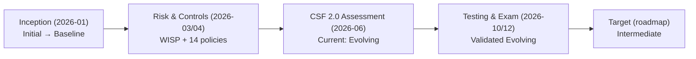
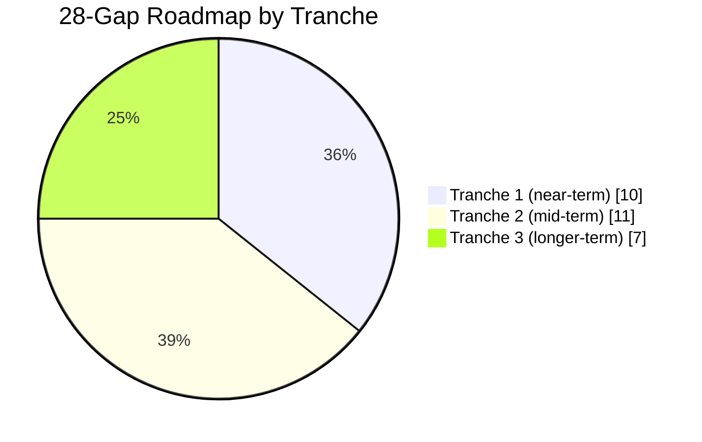

# 09.04 — Program Maturity Assessment

| Field | Value |
|---|---|
| Document ID | CCB-EXEC-MAT-2026-904 |
| Version | 1.0 |
| Date | 2026-06-15 |
| Classification | Confidential — Nonpublic Information (NPI) // Illustrative Portfolio Sample |
| Owner | Rachel Alvarez, Chief Information Security Officer (CISO) |
| Author | Advisory Team (Financial-Services GRC) |
| Status | Approved |

## Purpose

This assessment reports the **maturity** of Cornerstone Community Bank's information security program to the Board and executive management, scored against the **NIST CSF 2.0** framework (6 Functions: Govern, Identify, Protect, Detect, Respond, Recover). It documents the journey from program inception to the current state, scores each CSF 2.0 Function, tracks progress against the **28-gap roadmap** identified in Phase 05, and defines the **target state (Intermediate)**. Maturity is the forward-looking companion to the compliance dashboard (09.03): compliance answers "are we meeting obligations today," maturity answers "how durable and repeatable is the program becoming."

## Maturity Scale

Cornerstone uses a five-level scale mapped from the FFIEC Cybersecurity Assessment maturity domains (CAT sunset Aug 31, 2025) forward to NIST CSF 2.0.

| Level | Name | Description |
|---|---|---|
| 1 | Initial | Ad hoc, reactive; controls undocumented |
| 2 | Baseline | Minimum regulatory baseline; documented but inconsistent |
| 3 | **Evolving** | Formalized, risk-based; controls repeatable — **current state** |
| 4 | **Intermediate** | Integrated, measured, and monitored — **target state** |
| 5 | Advanced | Optimizing; automated, predictive, continuously improving |

## Maturity Journey — Inception to Current

At kickoff (2026-01) the program sat between Initial and Baseline, with fragmented documentation and no formal CSF profile. Twelve months of program build moved the enterprise to a consistent **Evolving** baseline.

## Maturity Scoring by NIST CSF 2.0 Function

| CSF 2.0 Function | Inception | Current | Target | Open Gaps |
|---|---|---|---|---|
| **Govern (GV)** | Baseline | Evolving | Intermediate | 4 |
| **Identify (ID)** | Baseline | Evolving | Intermediate | 5 |
| **Protect (PR)** | Initial | Evolving | Intermediate | 8 |
| **Detect (DE)** | Initial | Baseline→Evolving | Intermediate | 5 |
| **Respond (RS)** | Baseline | Evolving | Intermediate | 3 |
| **Recover (RC)** | Baseline | Evolving | Intermediate | 3 |
| **Total** | — | **Evolving** | **Intermediate** | **28** |

The overall current profile is **Evolving**, consistent with the Phase 05 assessment and validated by the FFIEC examination (Satisfactory / URSIT "2") and independent testing. Protect and Detect carry the largest share of open gaps, reflecting the deliberate investment path toward integrated, monitored controls.

### Function-Level Commentary

- **Govern (GV):** Board oversight, policy governance, and roles are formalized (WISP + 14 policies); remaining gaps concern integrating risk appetite and metrics into routine governance.
- **Identify (ID):** Asset inventory (140 systems) and the 42-risk assessment are complete; gaps center on continuous asset/data-flow visibility and supply-chain risk integration.
- **Protect (PR):** The largest gap concentration — access governance, data-centric protection, and phishing-resistant MFA completion drive the Tranche 1–2 investment.
- **Detect (DE):** Historically the least mature function; logging and alerting are established and moving from Baseline toward Evolving via monitoring uplift.
- **Respond (RS):** IR plan validated by tabletop; gaps concern measured response times and correlation.
- **Recover (RC):** BCP/DR tested with RTO/RPO met; gaps concern recovery metrics and integration with detection.

## 28-Gap Roadmap Progress

The Phase 05 gap analysis identified **28 maturity gaps**. These are organized into a Board-endorsed roadmap and are being closed in priority order. Progress is reported here at a summary level; the detailed gap register lives in Phase 05.

| Roadmap Tranche | Focus | Gaps | Status |
|---|---|---|---|
| Tranche 1 (near-term) | Detect/monitoring uplift, MFA expansion, logging | 10 | In progress — majority underway |
| Tranche 2 (mid-term) | Protect hardening, data-centric controls, access governance | 11 | Scoped & funded; sequenced after Tranche 1 |
| Tranche 3 (longer-term) | Govern/Identify integration, metrics automation | 7 | Planned; dependent on Tranche 1–2 outcomes |
| **Total** | — | **28** | On plan toward Intermediate |

## Target State — Intermediate

Reaching **Intermediate** maturity means controls are not only implemented but **integrated across functions, measured with defined metrics, and continuously monitored**. The transition criteria the Board should expect to see reported over the coming cycles:

| Dimension | Evolving (current) | Intermediate (target) |
|---|---|---|
| Control operation | Repeatable, risk-based | Integrated and monitored end-to-end |
| Metrics | KPIs/KRIs defined & reported (09.05) | KPIs/KRIs trended, threshold-driven, automated |
| Detection | Logging and alerting established | Correlated detection with measured response times |
| Governance | Board oversight & annual reporting | Continuous governance with real-time risk visibility |
| Third-party | Enhanced oversight of critical vendors | Continuous monitoring integrated into ERM |

## Board Read-Out

The program has advanced credibly from inception to a validated **Evolving** baseline in a single program year, corroborated by a Satisfactory examination and unqualified SOX opinion. The **28-gap roadmap to Intermediate** is funded (within the illustrative ~$1.4M annual program budget), sequenced, and owned by the CISO. Management recommends the Board endorse continued roadmap funding and expect quarterly maturity re-scoring.

## Cross-References

- `09.01-executive-summary.md` — program summary
- `09.03-compliance-posture-dashboard.md` — CSF 2.0 as an Amber obligation
- `09.05-kpi-and-kri-scorecard.md` — the metrics that evidence maturity
- `09.06-risk-posture-and-heat-map.md` — residual risk linkage
- `../05-ffiec-nist-csf-assessment/` — 28-gap analysis & target profile

[⬅ Previous](09.03-compliance-posture-dashboard.md) · [🏠 Phase README](09.00-README.md) · [Next ➡](09.05-kpi-and-kri-scorecard.md)
