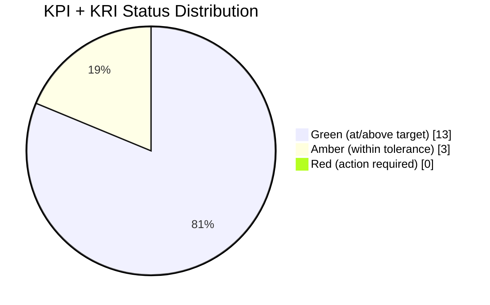

# 09.05 — KPI & KRI Scorecard

| Field | Value |
|---|---|
| Document ID | CCB-EXEC-KPI-2026-905 |
| Version | 1.0 |
| Date | 2026-06-15 |
| Classification | Confidential — Nonpublic Information (NPI) // Illustrative Portfolio Sample |
| Owner | Steven Nakamura, Chief Risk Officer (CRO) |
| Author | Advisory Team (Financial-Services GRC) |
| Status | Approved |

## Purpose

This scorecard presents the executive **Key Performance Indicators (KPIs)** and **Key Risk Indicators (KRIs)** that the Board and management use to monitor the health and risk of Cornerstone Community Bank's information security program. KPIs measure whether controls are operating as intended (performance); KRIs signal changes in the level of risk the Bank is carrying (exposure). Each metric is reported against a defined target with a RAG status, giving the Board an objective, trended basis for the assurance stated in the Annual GLBA Board Report (09.02) and the maturity assessment (09.04).

## Reading the Scorecard

| Rating | Meaning |
|---|---|
| 🟢 Green | At or better than target |
| 🟡 Amber | Within tolerance; below target; trending to plan |
| 🔴 Red | Outside tolerance; action required (none currently) |

## Key Performance Indicators (KPIs)

KPIs measure control operating effectiveness. Actuals reflect the current program-year position.

| KPI | Target | Actual | RAG | Trend | Owner |
|---|---|---|---|---|---|
| Patch SLA conformance (critical/high) | ≥ 95% | 96% | 🟢 | ↑ | Marcus Doyle |
| MFA coverage (privileged & remote access) | 100% | 98% | 🟡 | ↑ | Marcus Doyle |
| Access-review completion (quarterly) | 100% | 100% | 🟢 | → | Rachel Alvarez |
| Security-awareness training completion | ≥ 98% | 97% | 🟡 | ↑ | Angela Foster |
| Critical-vendor reviews current | 100% | 100% (12/12) | 🟢 | → | Steven Nakamura |
| Findings remediation (pen test) | 100% | 100% (14/14) | 🟢 | → | Rachel Alvarez |
| Internal-audit recommendation closure | ≥ 90% on time | 92% | 🟢 | ↑ | Priya Sharma |
| Backup / DR restore test success | 100% | 100% | 🟢 | → | James Porter |

## Key Risk Indicators (KRIs)

KRIs are leading/lagging signals of risk exposure. Thresholds define the point at which management escalates.

| KRI | Green Threshold | Actual | RAG | Trend | Owner |
|---|---|---|---|---|---|
| Phishing-simulation fail rate | ≤ 5% | 6% | 🟡 | ↓ | Angela Foster |
| Material security incidents | 0 | 0 | 🟢 | → | Rachel Alvarez |
| 36-hour notification incidents | 0 | 0 | 🟢 | → | Rachel Alvarez |
| Open High residual risks (untreated) | 0 | 0 | 🟢 | → | Steven Nakamura |
| Overdue critical/high vulnerabilities | 0 | 0 | 🟢 | → | Marcus Doyle |
| Overdue vendor risk reviews (critical) | 0 | 0 | 🟢 | → | Steven Nakamura |
| Privileged accounts without MFA | 0 | 0 | 🟢 | → | Marcus Doyle |
| CSF 2.0 gaps past roadmap due date | 0 | 0 | 🟢 | → | Rachel Alvarez |

## Scorecard Distribution

## Metrics Requiring Attention (Amber)

| Metric | Gap to Target | Action | Expected Path |
|---|---|---|---|
| MFA coverage (98% vs 100%) | Residual accounts pending phishing-resistant MFA cutover | Complete rollout to remaining accounts | Green next cycle |
| Training completion (97% vs 98%) | Late-cycle new hires / leave | Enforce completion; automated reminders | Green next cycle |
| Phishing-sim fail rate (6% vs ≤5%) | Slightly above threshold; improving | Targeted follow-up training for repeat clickers | Trending into Green |

## Exam & Audit Outcome Indicators

These lagging indicators confirm the program's external validation for the period.

| Outcome Indicator | Result | RAG |
|---|---|---|
| FFIEC IT examination rating | Satisfactory — URSIT composite "2" | 🟢 |
| SOX 404(b) external opinion (ICFR) | Unqualified; 0 material weaknesses | 🟢 |
| Internal audit of InfoSec program | Satisfactory with recommendations | 🟢 |
| ITGC deficiencies (material weaknesses) | 0 | 🟢 |

## Metric Governance & Methodology

Each metric has a defined owner, data source, and threshold, and is refreshed on the cadence below. Thresholds are set relative to the Bank's risk appetite and reviewed at least annually by the CRO and CISO. A metric that breaches its Red threshold triggers escalation to executive management and, for material items, to the Audit Committee.

| Attribute | Approach |
|---|---|
| Data sources | Ticketing/patch systems, IAM, LMS, vendor GRC, pen-test tracker, incident log |
| Refresh cadence | KPIs monthly; KRIs continuous-to-monthly; Board pack quarterly |
| Threshold review | Annually, or upon material risk change, by CRO + CISO |
| Escalation | Amber → management watch; Red → executive + Audit Committee |
| Assurance | Metrics reconciled to Phase 08 evidence and internal-audit sampling |

## Trend Narrative

The favorable trend arrows reflect a program in its first full operating year that is still climbing toward steady state. Patch conformance, MFA coverage, awareness training, and audit-recommendation closure are all improving; the phishing-simulation fail rate is declining toward its threshold. No metric is deteriorating. The zero-tolerance KRIs have held at zero throughout the period, which is the single most important signal for the Board: the Bank carried **no untreated High residual risk, no material incident, and no reportable notification incident** during the year.

## Board Read-Out

The scorecard is **predominantly Green** (13 of 16 operational metrics), with three Amber items — MFA coverage, training completion, and phishing-sim fail rate — each within tolerance and trending favorably, and **no Red items**. All zero-tolerance KRIs (material incidents, notification incidents, untreated High risks, overdue critical vulnerabilities) are at zero. The exam and audit outcome indicators independently confirm the program's effectiveness.

## Cross-References

- `09.01-executive-summary.md` — program summary
- `09.03-compliance-posture-dashboard.md` — obligation RAG view
- `09.04-program-maturity-assessment.md` — metrics as maturity evidence
- `09.06-risk-posture-and-heat-map.md` — KRIs feeding residual risk
- `../08-independent-testing-audit-exam-readiness/08.12-findings-remediation-tracker.md` — remediation source data

[⬅ Previous](09.04-program-maturity-assessment.md) · [🏠 Phase README](09.00-README.md) · [Next ➡](09.06-risk-posture-and-heat-map.md)
