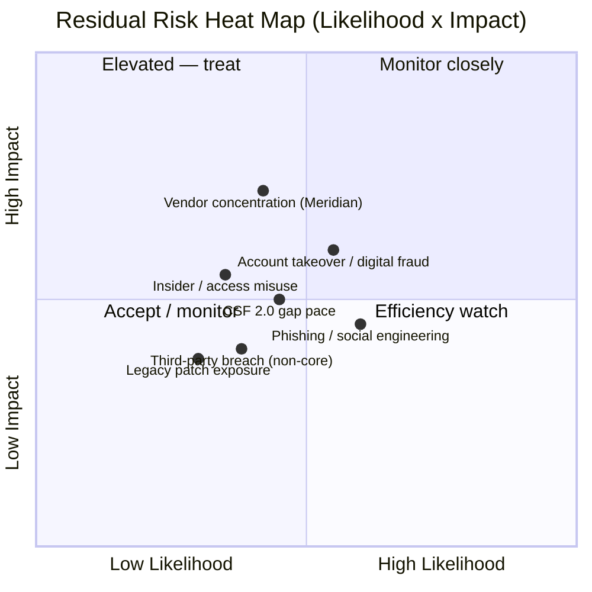
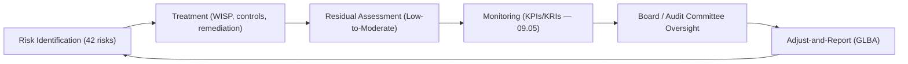

# 09.06 — Risk Posture & Heat Map

| Field | Value |
|---|---|
| Document ID | CCB-EXEC-RISK-2026-906 |
| Version | 1.0 |
| Date | 2026-06-15 |
| Classification | Confidential — Nonpublic Information (NPI) // Illustrative Portfolio Sample |
| Owner | Steven Nakamura, Chief Risk Officer (CRO) |
| Author | Advisory Team (Financial-Services GRC) |
| Status | Approved |

## Purpose

This document presents the Board and executive management with the Bank's **enterprise residual risk posture** at the close of the program year, using a likelihood-by-impact heat map and a register of the top residual risks carried forward. It translates the 42-risk assessment (Phase 03), after all treatment, into the language the Board governs by: enterprise risk — GLBA/compliance, reputational, financial, and operational. It is the risk-facing capstone that, together with the KPI/KRI scorecard (09.05), substantiates the residual-posture conclusion stated in the Annual GLBA Board Report (09.02).

## Enterprise Risk Posture — Summary

The enterprise assessment identified **42 risks (8 High / 18 Moderate / 16 Low)** with an **overall Moderate inherent** profile. After treatment — WISP + 14 policies, ITGC remediation, pen-test remediation, enhanced vendor oversight, and BCP/DR/IR validation — the Bank's **residual posture is Low-to-Moderate, well-managed.** Every High inherent risk has been reduced through an approved treatment plan; no High residual risk is accepted untreated.

| Rating | Inherent (Phase 03) | Residual (post-treatment) |
|---|---|---|
| High | 8 | 0 untreated (reduced to Moderate or below) |
| Moderate | 18 | Reduced set, monitored |
| Low | 16 | Stable, accepted with monitoring |
| **Overall** | **Moderate inherent** | **Low-to-Moderate residual** |

## Residual Risk Heat Map (Likelihood × Impact)

The heat map plots residual (post-treatment) risk concentrations. The mass has shifted down-and-left from the inherent profile: no residual risk sits in the top-right (High likelihood × High impact) zone.

### Reading the Heat Map

Residual risks are plotted on a likelihood (x) by impact (y) grid, each scored 0–1. The methodology follows NIST SP 800-30: likelihood reflects post-control probability of occurrence; impact reflects consequence to the Bank and its customers after mitigating controls. Points in the upper-right (elevated) quadrant would demand immediate treatment; the current profile has **no residual risk in that zone**, confirming that treatment has moved the portfolio down-and-left from its Moderate inherent position.

| Zone | Meaning | Current Occupancy |
|---|---|---|
| Upper-right (High L × High I) | Immediate treatment required | None |
| Upper-left (Low L × High I) | High-consequence, monitor & pre-plan | Vendor concentration (Meridian) |
| Mid-band | Manage to tolerance | Digital fraud, insider misuse, CSF gap pace |
| Lower zones | Accept with monitoring | Phishing, non-core vendor, legacy patch |

## Top Residual Risks Carried Forward

These are the residual exposures the Board should track. Each has a named owner and an active treatment or monitoring commitment.

| # | Residual Risk | Residual Rating | Owner | Treatment / Monitoring |
|---|---|---|---|---|
| RR-1 | Core-provider concentration (Meridian) | Moderate | Steven Nakamura (CRO) | Enhanced oversight; SOC 1/2 review; exit/continuity planning |
| RR-2 | Account takeover / digital-banking fraud | Moderate | Rachel Alvarez (CISO) | MFA, fraud monitoring, customer authentication controls |
| RR-3 | Phishing / social engineering | Low-Moderate | Angela Foster (CCO) | Awareness training; phishing sims; email security |
| RR-4 | Pace of closing CSF 2.0 maturity gaps | Low-Moderate | Rachel Alvarez (CISO) | Funded 28-gap roadmap; quarterly re-scoring |
| RR-5 | Insider / privileged-access misuse | Low-Moderate | Marcus Doyle (IT Sec Mgr) | Least privilege; access reviews; logging/monitoring |
| RR-6 | Non-core third-party breach | Low | Steven Nakamura (CRO) | Tiered due diligence; ongoing monitoring of 12 critical vendors |
| RR-7 | Legacy system / patch exposure | Low | James Porter (CIO) | Patch SLA (96% conformance); lifecycle management |

## Enterprise Risk Framing

The Board governs risk by its enterprise consequence. The table maps the top residual risks to the categories the Board manages.

| Risk Category | Primary Residual Exposures | Posture |
|---|---|---|
| **GLBA / Compliance** | Safeguards adequacy, vendor oversight, Reg P | Low-to-Moderate; obligations met (09.03) |
| **Reputational** | Digital fraud, breach of customer NPI | Moderate; actively mitigated |
| **Financial** | Fraud loss, ICFR (SOX) | Low; ICFR effective, unqualified opinion |
| **Operational / Resilience** | Core-provider dependency, availability | Moderate; BCP/DR tested, RTO/RPO met |

## Risk Governance Flow

## Risk Appetite Alignment

The Bank's residual posture is **within the Board's stated risk appetite** for a community bank of its size and complexity. No residual risk breaches appetite; the Moderate-rated residual risks (vendor concentration, digital fraud, resilience) are structural to the business model and are managed to tolerance rather than eliminated. Management asserts there is **no unmanaged High residual risk and no condition constituting a material weakness.**

## Board Read-Out

The enterprise moved from a **Moderate inherent** profile to a **Low-to-Moderate, well-managed residual** posture. The residual mass sits outside the elevated quadrant, all High risks are treated, and the top seven residual risks each carry a named owner and active monitoring. This posture is corroborated by the Satisfactory FFIEC examination, the unqualified SOX opinion, and the KPI/KRI scorecard. Management recommends the Board accept the residual posture as within appetite and endorse continued monitoring and roadmap execution.

## Cross-References

- `09.01-executive-summary.md` — program summary
- `09.02-annual-glba-board-report.md` — residual-posture statement
- `09.05-kpi-and-kri-scorecard.md` — KRIs behind the heat map
- `09.07-regulatory-exam-and-audit-outcomes.md` — exam & audit outcomes detail
- `../03-risk-assessment/` — 42-risk inherent baseline
- `../07-third-party-risk-business-continuity/` — Meridian concentration

[⬅ Previous](09.05-kpi-and-kri-scorecard.md) · [🏠 Phase README](09.00-README.md) · [Next ➡](09.07-regulatory-exam-and-audit-outcomes.md)
