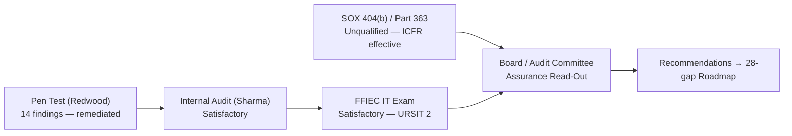

# 09.07 — Regulatory Exam &amp; Audit Outcomes

| Field | Value |
|---|---|
| Document ID | CCB-EXEC-EXAM-2026-907 |
| Version | 1.0 |
| Date | 2026-06-15 |
| Classification | Confidential — Nonpublic Information (NPI) // Illustrative Portfolio Sample |
| Owner | Rachel Alvarez, Chief Information Security Officer (CISO) |
| Author | Advisory Team (Financial-Services GRC) |
| Status | Approved |

## Purpose

This document consolidates, for the Board and executive management, the **independent examination and audit outcomes** that assure the Bank's information security and financial-reporting control environment at the close of the program year. It brings four distinct external and internal assurance results into a single Board-facing view: the **FFIEC IT examination** (Satisfactory / URSIT composite "2"), the **SOX 404(b) / FDICIA Part 363 external audit** (unqualified opinion, ICFR effective, zero material weaknesses), the **independent penetration test** (14 findings, all remediated), and the **internal audit** (Satisfactory with recommendations). For each, it explains what the outcome means, what the examiners and auditors recommended, and how those recommendations are being closed. Together these results provide the third-party corroboration behind the residual-posture conclusion in the Annual GLBA Board Report (09.02) and the risk posture in 09.06.

## Assurance-at-a-Glance

The Bank subjected its program to four independent assessments during the program year. All four returned favorable conclusions with no material weakness, no adverse finding, and no unremediated high-severity issue.

| Assessment | Independent Party | Timing | Result |
|---|---|---|---|
| FFIEC IT Examination | FDIC / Ohio DFI (joint) | Fieldwork 2026-11; report 2026-12-15 | **Satisfactory — URSIT composite "2"** |
| SOX 404(b) / FDICIA Part 363 ICFR Audit | Whitmore &amp; Associates, LLP | FY2026 audit; opinion 2027-02 | **Unqualified — ICFR effective, 0 material weaknesses** |
| Independent Penetration Test | Redwood Security Partners, LLC | Fieldwork 2026-10 | **14 findings (2 High / 6 Medium / 6 Low) — all remediated** |
| Internal Audit (IT / Information Security) | Priya Sharma, Director of Internal Audit | 2026-11 | **Satisfactory with recommendations** |

## FFIEC IT Examination — Satisfactory (URSIT Composite "2")

The FFIEC IT examination, conducted jointly by the FDIC and the Ohio Division of Financial Institutions, assigned a **composite "2" (Satisfactory)** under the Uniform Rating System for Information Technology (URSIT). A composite "2" denotes an institution whose IT and information-security risk-management practices are sound, whose weaknesses are minor and well within management's ability to correct in the normal course, and whose risk-management processes adequately identify and control IT risk. The report was issued **2026-12-15**.

URSIT scores four components on a 1 (strongest) to 5 (weakest) scale, then derives a composite rating. Cornerstone rated "2" on every component.

| URSIT Component | Rating | Examiner Basis |
|---|---|---|
| **Audit** | 2 | Independent internal audit function reporting to the Audit Committee; risk-based coverage; timely issue tracking |
| **Management** | 2 | Board-approved WISP, named CISO, defined governance, annual GLBA reporting, effective third-party oversight |
| **Development &amp; Acquisition** | 2 | Formal change and SDLC controls; SOC 1/SOC 2 reliance on Meridian for outsourced core; vendor due diligence |
| **Support &amp; Delivery** | 2 | Operations, resilience (BCP/DR with RTO/RPO met), access management, and incident response validated by tabletop |
| **Composite** | **2** | **Satisfactory — sound practices, minor and correctable weaknesses** |

### Examination Recommendations and Closure

The examination raised a small number of recommendations rather than any Matter Requiring Board Attention (MRBA). Each maps to an existing, funded item on the 28-gap roadmap, which is why the examiners were satisfied the weaknesses were correctable in the normal course.

| # | Examiner Recommendation | Mapped To | Owner | Status |
|---|---|---|---|---|
| EX-1 | Advance detection/monitoring toward correlated, measured response (SIEM/MDR) | Roadmap Tranche 1 (Detect uplift) | Rachel Alvarez (CISO) | In progress — funded |
| EX-2 | Complete phishing-resistant MFA rollout across remaining privileged paths | Roadmap Tranche 1/2 (Protect) | Marcus Doyle (IT Sec Mgr) | In progress |
| EX-3 | Integrate continuous third-party monitoring into ERM cadence | Roadmap Tranche 3; TPRM program (Phase 07) | Steven Nakamura (CRO) | Scoped &amp; sequenced |
| EX-4 | Formalize threshold-driven metrics reporting to the Board | KPI/KRI scorecard (09.05) automation | Rachel Alvarez (CISO) | In progress |

## SOX 404(b) / FDICIA Part 363 — Unqualified Opinion

Because Cornerstone Bancorp, Inc. (Nasdaq: CCBK) is a public SEC registrant and the Bank exceeds $1 billion in assets, both **SOX Section 404** and **FDICIA Part 363** apply. The independent registered public accounting firm, **Whitmore &amp; Associates, LLP**, issued an **unqualified opinion** on internal control over financial reporting (ICFR): ICFR is **effective**, with **zero material weaknesses**.

ITGC testing (Phase 06) covered **48 key IT general controls** across four domains, with reliance on Meridian's **SOC 1 Type II** report for the outsourced core. Testing identified **three deficiencies** — one significant deficiency and two control deficiencies — none rising to a material weakness, and **all remediated** and retested prior to opinion issuance.

| ITGC Domain | Key Controls | Deficiencies Identified | Status |
|---|---|---|---|
| Access to Programs &amp; Data | (subset of 48) | 1 significant deficiency | Remediated &amp; retested |
| Program Changes | (subset of 48) | 1 control deficiency | Remediated &amp; retested |
| Program Development / SDLC | (subset of 48) | 0 | Effective |
| Computer Operations | (subset of 48) | 1 control deficiency | Remediated &amp; retested |
| **Total** | **48** | **3 (1 SD, 2 CD, 0 MW)** | **All remediated** |

## Independent Penetration Test — All Findings Remediated

**Redwood Security Partners, LLC** performed external and internal penetration testing and vulnerability assessment in 2026-10, identifying **14 findings (2 High, 6 Medium, 6 Low)**. Every finding has been remediated and validated. No exploitable path to customer NPI remained open at report close.

| Severity | Findings | Disposition |
|---|---|---|
| High | 2 | Remediated &amp; retested |
| Medium | 6 | Remediated &amp; retested |
| Low | 6 | Remediated / risk-accepted with compensating controls |
| **Total** | **14** | **100% remediated** |

## Internal Audit — Satisfactory with Recommendations

The internal audit function, led by **Priya Sharma** and reporting functionally to the **Audit Committee (Robert Hanley, Chair)**, issued a **Satisfactory** opinion on the information-security and IT control environment, with recommendations. The recommendations are tracked to closure in the internal audit issue-management system and overlap substantially with the examination recommendations, reinforcing a consistent forward agenda rather than divergent findings.

## What Each Outcome Means for the Board

Assurance results only govern well when their meaning is plain. The table translates each technical outcome into its Board-level significance.

| Outcome | Plain-Language Meaning | Board Significance |
|---|---|---|
| URSIT composite "2" | Sound IT risk management; weaknesses minor and correctable | No supervisory action; continued good standing |
| Unqualified ICFR opinion | Financial reporting controls operate effectively | Reliable financial statements; investor confidence (CCBK) |
| 0 material weaknesses | No control gap could cause a material misstatement | No 10-K disclosure of a material weakness |
| Pen test fully remediated | No open exploitable path to NPI | Customer data defensibly protected |
| Internal audit Satisfactory | Independent internal validation of the environment | Audit Committee assurance is corroborated |

## Regulatory Notification Readiness

The examination also considered the Bank's readiness under the **Computer-Security Incident Notification Rule** (2022), which requires notifying the primary federal regulator within **36 hours** of a qualifying notification incident. The Bank's incident response plan encodes the 36-hour trigger, notification path, and decision criteria, validated by tabletop. Examiners found the process defined and understood; no notification incident occurred during the period.

## Consolidated Outcome Flow

## Board Read-Out

Four independent assurance providers — the FDIC/Ohio DFI, Whitmore &amp; Associates, Redwood Security Partners, and internal audit — reached **mutually corroborating favorable conclusions**. There is no material weakness, no MRBA, no adverse audit opinion, and no unremediated high-severity finding. The recommendations that were raised are minor, correctable, funded, and already mapped to the 28-gap roadmap toward Intermediate maturity. Management recommends the Board accept these outcomes as independent validation that the program is compliant and well-managed, and endorse continued closure of the mapped recommendations.

## Cross-References

- `09.02-annual-glba-board-report.md` — annual GLBA report and residual-posture statement
- `09.03-compliance-posture-dashboard.md` — obligation-by-obligation status
- `09.06-risk-posture-and-heat-map.md` — residual risk corroborated by these outcomes
- `09.09-continuous-improvement-roadmap.md` — where recommendations are being closed
- `../06-sox-itgc-fdicia/` — 48 ITGC controls and deficiency remediation
- `../08-independent-testing-audit-exam-readiness/` — pen test and exam-readiness detail

[⬅ Previous](09.06-risk-posture-and-heat-map.md) · [🏠 Phase README](09.00-README.md) · [Next ➡](09.08-budget-resourcing-and-roi.md)
