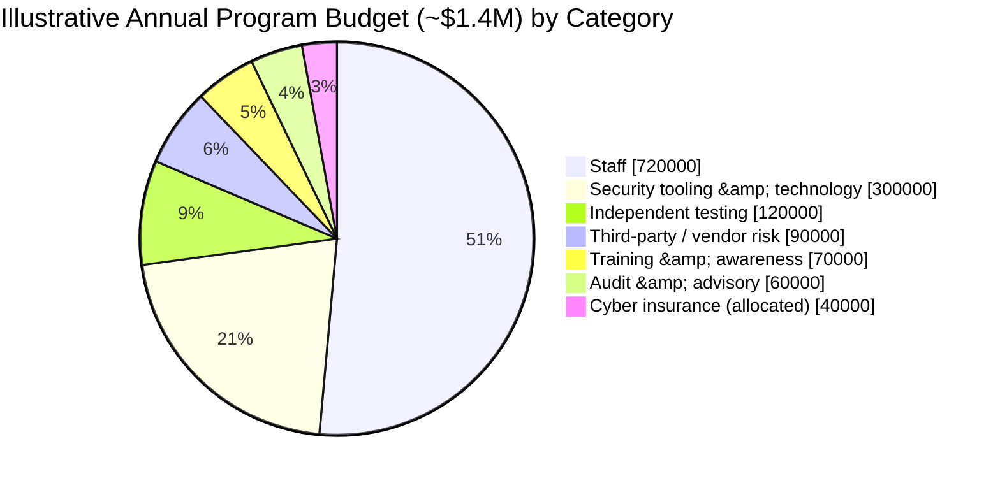
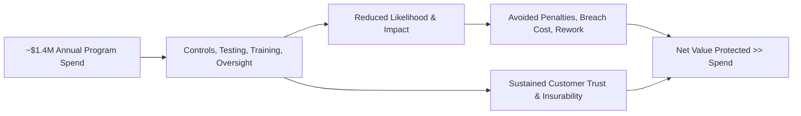

# 09.08 — Budget, Resourcing &amp; ROI

| Field | Value |
|---|---|
| Document ID | CCB-EXEC-BUDG-2026-908 |
| Version | 1.0 |
| Date | 2026-06-15 |
| Classification | Confidential — Nonpublic Information (NPI) // Illustrative Portfolio Sample |
| Owner | Linda Barrett, Chief Financial Officer (CFO) |
| Author | Advisory Team (Financial-Services GRC) |
| Status | Approved |

## Purpose

This document presents the Board and executive management with the **cost and value** of Cornerstone Community Bank's information security and GLBA compliance program. It sets out the program's people and its **illustrative ~$1.4 million annual operating budget**, explains how those resources are allocated across tooling, testing, training, audit, and staff, and frames the **return on investment (ROI)** in the terms a bank Board governs by: avoided regulatory penalties and enforcement, avoided breach cost, examination and audit efficiency, customer trust and retention, and insurability. All figures are **illustrative** for this fictional portfolio and are presented to demonstrate a defensible budgeting and value narrative, not to represent actual expenditures.

## Program Resourcing — The Team

The program is led by the **CISO (Rachel Alvarez)** and delivered by a lean information-security function, supported by cross-functional partners in IT, Risk, Compliance, Privacy, and Internal Audit, and by external specialists engaged for independent testing and audit. This "small core, strong partners" model is appropriate for an ~240-employee, ~$1.2B-asset community bank.

| Role | Name | Function |
|---|---|---|
| Chief Information Security Officer / ISO | Rachel Alvarez | Program owner; Board reporting; risk acceptance |
| IT Security Manager | Marcus Doyle | Day-to-day security operations; control operation |
| Security Analysts (team) | Security operations staff | Monitoring, vulnerability mgmt, access reviews, IR support |
| Chief Information Officer | James Porter | Infrastructure, change, and operations partnership |
| Chief Risk Officer | Steven Nakamura | ERM integration; third-party risk |
| Chief Compliance Officer / Privacy Officer | Angela Foster / Karen Ellis | GLBA, Reg P, awareness |
| Director of Internal Audit | Priya Sharma | Independent assurance to Audit Committee |
| External specialists | Redwood Security Partners; Whitmore &amp; Associates | Pen testing; ICFR/SOX audit |

## Illustrative Annual Program Budget (~$1.4M)

The program operates on an **illustrative ~$1.4M annual budget**. Staff cost is the largest line, consistent with a people-led control environment; technology, independent testing, training, and audit make up the balance. The allocation below is illustrative and rounded.

| Category | Illustrative Annual ($) | Share | What It Funds |
|---|---|---|---|
| Staff (CISO, IT Security Manager, analysts) | 720,000 | ~51% | Salaries, benefits, and on-call for the security function |
| Security tooling &amp; technology | 300,000 | ~21% | Identity/MFA, logging, endpoint, email security, vuln mgmt; SIEM/MDR investment |
| Independent testing &amp; assessment | 120,000 | ~9% | Pen testing (Redwood), vulnerability assessment, CSF re-scoring |
| Third-party / vendor risk &amp; SOC review | 90,000 | ~6% | TPRM tooling, SOC 1/2 review, Meridian oversight |
| Training &amp; awareness | 70,000 | ~5% | Security awareness, phishing simulations, role-based training |
| Audit &amp; advisory support | 60,000 | ~4% | Internal audit support; GRC advisory |
| Cyber insurance premium (allocated) | 40,000 | ~3% | Program share of cyber liability coverage |
| **Total (illustrative)** | **~1,400,000** | **100%** | **Full annual program run-rate** |

## ROI Framing — Value Delivered

For a security and compliance program, "return" is best expressed as **loss and cost avoided plus value protected**. The following framing translates the ~$1.4M spend into the outcomes the Board cares about. All figures are illustrative.

| Value Driver | How the Program Delivers | Illustrative Value / Basis |
|---|---|---|
| Avoided penalties &amp; enforcement | GLBA Safeguards, Reg P, and 36-hour notification compliance; Satisfactory exam | Avoidance of consent orders, civil money penalties, and remediation costs |
| Avoided breach cost | Controls, remediation of 14 pen-test findings, MFA, monitoring | Community-bank breach events commonly run into the millions; program lowers likelihood and impact |
| Examination &amp; audit efficiency | Exam-ready evidence; unqualified SOX; fewer findings | Reduced examiner/auditor cycles and remediation labor |
| Customer trust &amp; retention | Protection of NPI for ~85,000 customers; ~62,000 digital users | Retained deposits and digital adoption; reputational protection |
| Insurability &amp; premium | Demonstrable controls support underwriting | Access to cyber coverage on favorable terms |
| Capital &amp; strategic optionality | Well-managed posture supports growth, M&amp;A, and product launch | Regulatory good standing as a strategic enabler |

### ROI Logic

The program's cost is a small fraction of a single avoided material breach or enforcement action, before counting the compounding value of customer trust, deposit retention, and regulatory good standing. On that basis, management assesses the program's return as **strongly positive**.

## Cost in Context — Benchmarking

The illustrative ~$1.4M run-rate is proportionate for an institution of Cornerstone's size and complexity. Expressed as a ratio, security and compliance spend is a small percentage of a ~$1.2B-asset balance sheet and a rational insurance premium against the enterprise's most severe operational and reputational exposures.

| Reference Point | Illustrative Comparison |
|---|---|
| Program spend vs. total assets (~$1.2B) | A fraction of one basis point of assets per year |
| Program spend vs. a single material breach | Well below the multi-million-dollar cost of one serious event |
| Program spend vs. an enforcement remediation | Below the typical cost of a consent-order remediation program |
| Program spend per digital-banking user (~62,000) | A modest per-user cost to protect the digital channel |

## Multi-Year Cost Outlook

The run-rate is expected to remain broadly stable as the Bank advances to Intermediate maturity, with technology carrying the incremental detection-automation investment and staff cost growing only with normal compensation trends.

| Horizon | Expected Run-Rate Direction | Driver |
|---|---|---|
| Year 1 (current) | ~$1.4M baseline | Sustain Evolving posture + Tranche 1 |
| Year 2 | Broadly stable | SIEM/MDR moves from standup to steady-state |
| Year 3 | Broadly stable | Efficiency from automation offsets new emerging-risk work |

## Budget Governance and Adequacy

The budget is **sufficient to sustain the current Evolving posture and to fund the 28-gap roadmap toward Intermediate maturity** within the planning horizon. The largest planned incremental investment — SIEM/MDR and detection automation — sits inside the technology line and is sequenced in Tranche 1 of the roadmap. Management does not project a step-change in run-rate to reach Intermediate; the path is one of disciplined, sequenced investment rather than large capital outlay.

| Budget Question | Board-Level Answer |
|---|---|
| Is the program adequately funded today? | Yes — ~$1.4M supports current Evolving posture and obligations |
| Does the roadmap require a budget step-change? | No — incremental, sequenced investment within existing lines |
| What is the biggest funded initiative? | Detection automation (SIEM/MDR) in Tranche 1 |
| How is spend justified? | Loss/cost avoided, exam efficiency, trust, insurability |

## Board Read-Out

The program delivers a **Satisfactory examination, an unqualified SOX opinion, and a Low-to-Moderate residual posture on an illustrative ~$1.4M annual budget** — a modest spend for a ~$1.2B-asset bank protecting NPI for ~85,000 customers. The staffing model is lean and appropriately supported by external specialists; the budget is adequate to both sustain current operations and fund the roadmap to Intermediate without a run-rate step-change. Management recommends the Board approve continuation of the program budget at approximately its current level, with the technology line carrying the incremental detection-automation investment.

## Cross-References

- `09.01-executive-summary.md` — program summary
- `09.04-program-maturity-assessment.md` — 28-gap roadmap the budget funds
- `09.07-regulatory-exam-and-audit-outcomes.md` — outcomes the spend produced
- `09.09-continuous-improvement-roadmap.md` — sequenced investment plan
- `../08-independent-testing-audit-exam-readiness/` — independent testing costs

[⬅ Previous](09.07-regulatory-exam-and-audit-outcomes.md) · [🏠 Phase README](09.00-README.md) · [Next ➡](09.09-continuous-improvement-roadmap.md)
