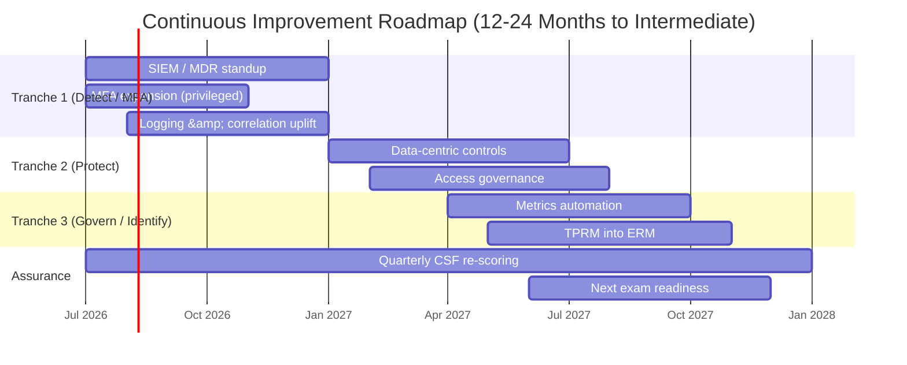
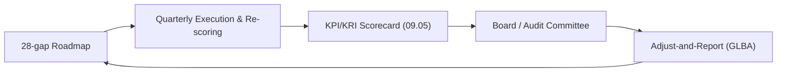

# 09.09 — Continuous Improvement Roadmap

| Field | Value |
|---|---|
| Document ID | CCB-EXEC-ROAD-2026-909 |
| Version | 1.0 |
| Date | 2026-06-15 |
| Classification | Confidential — Nonpublic Information (NPI) // Illustrative Portfolio Sample |
| Owner | Rachel Alvarez, Chief Information Security Officer (CISO) |
| Author | Advisory Team (Financial-Services GRC) |
| Status | Approved |

## Purpose

This document sets out the Bank's **forward 12–24 month continuous improvement roadmap** for the Board and executive management. It defines how Cornerstone will close the remaining **28 NIST CSF 2.0 maturity gaps** to reach **Intermediate**, advance toward **Advanced** in its strongest functions, prepare for the next examination cycle, and monitor emerging risks — AI governance, evolving FFIEC guidance, and quantum-safe cryptography. The roadmap operationalizes the recommendations from the FFIEC examination, internal audit, and independent testing (09.07), is funded within the illustrative ~$1.4M annual budget (09.08), and turns the "Evolving → Intermediate" maturity target (09.04) into a sequenced, owned, time-bound plan.

## Roadmap Objectives

| Objective | From | To | Horizon |
|---|---|---|---|
| Close remaining CSF 2.0 maturity gaps | Evolving | Intermediate | 12–24 months |
| Automate Detect / Respond / Recover | Logging &amp; alerting | Correlated, measured, automated | Tranche 1–2 |
| Advance strongest functions | Evolving | Toward Advanced (Govern, Recover) | 18–24 months |
| Sustain regulatory good standing | Satisfactory (URSIT 2) | Maintain or improve at next exam | Next exam cycle |
| Monitor emerging risk | Watch | Governed &amp; assessed | Continuous |

## The 28-Gap Closure Plan (to Intermediate)

The Phase 05 gap analysis produced **28 maturity gaps**, organized into three sequenced tranches. Tranche 1 concentrates on the least-mature functions (Detect and Protect), where examiner and audit recommendations also point. Progress is re-scored quarterly.

| Tranche | Focus | Gaps | Target Window | Owner |
|---|---|---|---|---|
| Tranche 1 (near-term) | Detect/monitoring uplift (SIEM/MDR), MFA expansion, logging | 10 | 0–9 months | Rachel Alvarez / Marcus Doyle |
| Tranche 2 (mid-term) | Protect hardening, data-centric controls, access governance | 11 | 6–18 months | Marcus Doyle |
| Tranche 3 (longer-term) | Govern/Identify integration, metrics automation, TPRM-into-ERM | 7 | 12–24 months | Rachel Alvarez / Steven Nakamura |
| **Total** | — | **28** | **On plan to Intermediate** | CISO |

## Detect / Respond / Recover Automation

The largest maturity lift is in the historically least-mature functions. The centerpiece is a **SIEM / Managed Detection and Response (MDR)** capability with **threat intelligence** integration, moving the Bank from established logging to correlated, measured detection and orchestrated response.

| Capability | Current State | Target State | Function |
|---|---|---|---|
| Log aggregation &amp; correlation | Logging established, limited correlation | SIEM with correlated use cases | Detect |
| Managed detection &amp; response | Business-hours monitoring | 24x7 MDR coverage | Detect / Respond |
| Threat intelligence | Ad hoc | Integrated feeds informing detection | Identify / Detect |
| Incident response | Plan validated by tabletop | Measured MTTD/MTTR, playbook automation | Respond |
| Recovery | BCP/DR tested, RTO/RPO met | Recovery metrics integrated with detection | Recover |

## Advancing Toward Advanced (Strong Functions)

Where the program is already comparatively strong — **Govern** (Board-approved WISP, defined roles, annual reporting) and **Recover** (tested BCP/DR meeting RTO/RPO) — the roadmap pushes selectively toward **Advanced**: continuous, metric-driven governance and recovery that is measured and integrated. This is deliberately selective; the Bank does not pursue Advanced uniformly, only where risk and cost justify it.

## Next Examination Cycle Preparation

The roadmap keeps the Bank continuously exam-ready rather than mounting a point-in-time push. The objective is to enter the next FFIEC IT examination with the current recommendations closed and evidence of sustained monitoring.

| Exam-Readiness Item | Action | Target |
|---|---|---|
| Close EX-1..EX-4 recommendations (09.07) | Execute Tranche 1 detection &amp; MFA work | Before next exam fieldwork |
| Continuous evidence library | Maintain always-current control evidence | Ongoing |
| CSF 2.0 re-scoring | Quarterly re-score; trend to Board | Quarterly |
| Third-party monitoring in ERM | Integrate continuous vendor monitoring | Tranche 3 |

## Emerging Risk Watch

The roadmap includes a forward-looking watch on risks that are not yet material to a community bank of this size but warrant governance now.

| Emerging Item | Why It Matters | Bank's Posture |
|---|---|---|
| **AI / GenAI risk** | Model, data-leakage, and third-party AI exposure; supervisory attention rising | Establish AI use governance; extend TPRM to AI-enabled vendors |
| **Evolving FFIEC guidance** | Post-CAT-sunset direction; continued shift to CSF 2.0 / CRI Profile crosswalks | Maintain CSF 2.0 spine; monitor interagency updates |
| **Quantum-safe cryptography** | Long-horizon threat to current public-key crypto ("harvest-now, decrypt-later") | Watch NIST PQC standards; inventory crypto for future migration |
| **Fraud &amp; social engineering evolution** | Account takeover and deepfake-enabled fraud | Strengthen authentication, awareness, and detection |

## Roadmap Timeline

## Dependencies and Cost of Inaction

Each tranche carries dependencies and a cost of deferral. Sequencing is deliberate: Detect uplift must precede measured response, and Protect hardening depends on completed access governance.

| Tranche | Key Dependency | Cost of Deferral |
|---|---|---|
| Tranche 1 (Detect / MFA) | Tooling procurement; log source onboarding | Slower breach detection; recurring examiner recommendation |
| Tranche 2 (Protect) | Access governance foundations | Weaker data-centric protection; residual insider risk |
| Tranche 3 (Govern / Identify) | Tranche 1–2 outputs; ERM alignment | Manual reporting; fragmented third-party visibility |

## Success Criteria

The roadmap is complete when the following observable conditions hold at the next re-scoring and examination cycle.

| Criterion | Evidence of Success |
|---|---|
| Overall maturity | CSF 2.0 profile re-scored to **Intermediate** |
| Detection | SIEM/MDR live with measured MTTD/MTTR |
| Recommendations | EX-1..EX-4 and audit items closed and evidenced |
| Governance | Threshold-driven KPI/KRI reporting automated to the Board |
| Emerging risk | AI-use governance in place; PQC and FFIEC watch documented |

## Governance and Reporting Cadence

## Board Read-Out

The roadmap converts the maturity target into a **sequenced, funded, owned, and time-bound plan** to reach Intermediate within 12–24 months, with selective advancement toward Advanced in the Bank's strongest functions. Its priorities — detection automation (SIEM/MDR), MFA completion, and third-party monitoring — are the same items flagged by the examiners, auditors, and testers, ensuring the Bank enters the next exam cycle with recommendations closed. The emerging-risk watch keeps AI, FFIEC evolution, and quantum-safe cryptography under governance before they become material. Management recommends the Board endorse the roadmap and its quarterly re-scoring cadence.

## Cross-References

- `09.04-program-maturity-assessment.md` — Evolving → Intermediate and the 28 gaps
- `09.05-kpi-and-kri-scorecard.md` — metrics tracking roadmap progress
- `09.07-regulatory-exam-and-audit-outcomes.md` — recommendations this roadmap closes
- `09.08-budget-resourcing-and-roi.md` — funding for the roadmap
- `../05-ffiec-nist-csf-assessment/` — CSF 2.0 target profile &amp; gap register

[⬅ Previous](09.08-budget-resourcing-and-roi.md) · [🏠 Phase README](09.00-README.md) · [Next ➡](09.10-lessons-learned-retrospective.md)
