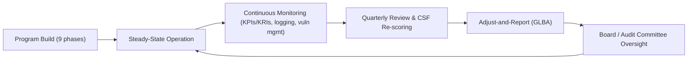

# 09.10 — Lessons Learned &amp; Retrospective

| Field | Value |
|---|---|
| Document ID | CCB-EXEC-RETRO-2026-910 |
| Version | 1.0 |
| Date | 2026-06-15 |
| Classification | Confidential — Nonpublic Information (NPI) // Illustrative Portfolio Sample |
| Owner | Rachel Alvarez, Chief Information Security Officer (CISO) |
| Author | Advisory Team (Financial-Services GRC) |
| Status | Approved |

## Purpose

This document is an honest **retrospective across the nine-phase program**, prepared for executive management and the Board. It records what worked, what proved difficult, and what the Bank will carry forward — so the value of the engagement is not just the artifacts produced but the institutional learning that makes the program durable. It applies a **What-Went-Well / What-Was-Hard / Continue-Stop-Start** structure and closes on how **continuous monitoring** sustains the posture the program achieved. It is candid by design: a Satisfactory examination and unqualified SOX opinion are the outcomes, but this document tells the Board what it actually took to get there.

## The Journey in One View

Over roughly twelve months (kickoff 2026-01-12), the program moved the Bank from fragmented, largely undocumented practices to a validated **Evolving** posture with independent assurance across the board.

| Dimension | At Kickoff (2026-01) | At Close (2026-12) |
|---|---|---|
| Documentation | Fragmented, informal | WISP + 14 policies, board-approved |
| Risk visibility | Ad hoc | 42-risk assessment, ranked &amp; treated |
| Maturity | Initial → Baseline | **Evolving**, validated |
| Assurance | None current | Satisfactory exam, unqualified SOX, remediated pen test |
| Residual posture | Unknown | **Low-to-Moderate, well-managed** |

## What Went Well

| # | What Went Well | Why It Mattered |
|---|---|---|
| 1 | **Risk-driven design** | Building the WISP and controls off the 42-risk assessment meant effort followed exposure, not checklists — examiners credited the risk basis |
| 2 | **Board sponsorship** | Visible Board and Audit Committee ownership unlocked funding, cross-functional cooperation, and timely decisions |
| 3 | **Phishing-resistant MFA** | Prioritizing strong authentication cut the most probable attack path and demonstrated tangible risk reduction early |
| 4 | **NIST CSF 2.0 transition** | Adopting CSF 2.0 as the spine (post-CAT-sunset) gave a durable, future-proof measurement framework with a clear target profile |
| 5 | **Independent testing discipline** | Engaging Redwood early and remediating all 14 findings turned testing into improvement rather than a report on the shelf |
| 6 | **Single canonical fact base** | Consistent scoping numbers across phases produced coherent, examiner-ready evidence with no contradictions |

## What Was Hard

Candor here is deliberate; these are the friction points the Board should understand.

| # | What Was Hard | How It Was Handled |
|---|---|---|
| 1 | **Detect maturity lagged** | Logging existed but correlation did not; accepted as the largest gap and sequenced first in the roadmap (SIEM/MDR) |
| 2 | **Core-provider dependency (Meridian)** | Outsourced core limits direct control; managed via SOC 1/2 reliance, enhanced oversight, and exit/continuity planning |
| 3 | **Lean staffing vs. scope** | A small security team against 140 systems required ruthless prioritization and external specialist support |
| 4 | **SOX ITGC remediation under deadline** | 3 deficiencies surfaced during testing; remediated and retested before opinion — tight but achieved |
| 5 | **Evidence discipline across phases** | Keeping always-current evidence took cultural change; moved from scramble to a maintained evidence library |
| 6 | **Balancing build vs. run** | Standing up controls while operating the bank required careful change sequencing to avoid disruption |

## Continue / Stop / Start

| Action | Item | Rationale |
|---|---|---|
| **Continue** | Risk-driven prioritization; Board reporting cadence; phishing-resistant MFA; quarterly CSF re-scoring | These produced the outcomes and are low-cost to sustain |
| **Continue** | Independent testing and SOC review discipline | Keeps assurance current and examiner-ready |
| **Stop** | Point-in-time, scramble-style exam preparation | Replaced by continuous exam readiness |
| **Stop** | Treating findings as reports rather than backlog items | All findings now flow to a tracked remediation backlog |
| **Start** | Detection automation (SIEM/MDR) and measured response | Closes the largest maturity gap |
| **Start** | Formal AI-use and emerging-risk governance | Gets ahead of supervisory attention and new exposures |

## Phase-by-Phase Lessons

Each phase left a specific, transferable lesson that the Bank carries into steady-state operation.

| Phase | Lesson Carried Forward |
|---|---|
| 01 Foundation | Scoping the full regulatory register up front prevented rework later |
| 02 Asset Inventory | You cannot protect what you have not inventoried — the 140-system baseline anchored everything |
| 03 Risk Assessment | Ranking 42 risks made prioritization objective and defensible to examiners |
| 04 Control Design | Policy is only real once the Board approves and staff operate it |
| 05 CSF 2.0 | A single measurement spine beats a patchwork of checklists |
| 06 SOX ITGC | Deficiencies found early and remediated are routine; found late they are crises |
| 07 Third-Party | Outsourced core means governing a dependency you cannot fully control |
| 08 Testing | Testing is only valuable if every finding is driven to closure |
| 09 Board Reporting | Assurance must be translated into the Board's language to govern well |

## Engagement Metrics

The retrospective is grounded in measurable delivery across the program year.

| Metric | Value |
|---|---|
| Phases delivered | 9 of 9 |
| Risks assessed &amp; treated | 42 |
| Core policies established | 14 (under one WISP) |
| ITGC deficiencies remediated | 3 (0 material weaknesses) |
| Pen-test findings remediated | 14 |
| Maturity gaps roadmapped | 28 |
| Independent assurance opinions (favorable) | 4 |

## From Project to Program — Sustaining the Posture

The engagement was time-bound; the risk is not. The single most important lesson is that a Satisfactory posture is **sustained by continuous monitoring, not by the project that created it.** The mechanisms below convert one-time build into steady-state operation.

| Sustaining Mechanism | Cadence | Owner |
|---|---|---|
| KPI/KRI scorecard review | Quarterly | Rachel Alvarez (CISO) |
| CSF 2.0 maturity re-scoring | Quarterly | Rachel Alvarez (CISO) |
| Vulnerability management &amp; patch SLA | Continuous | Marcus Doyle (IT Sec Mgr) |
| Third-party / SOC review | Annual + event-driven | Steven Nakamura (CRO) |
| Annual GLBA Board report &amp; adjust | Annual | Rachel Alvarez (CISO) |
| Independent testing &amp; internal audit | Annual | Redwood / Priya Sharma |

## Board Read-Out

The program achieved a Satisfactory examination, an unqualified SOX opinion, and a Low-to-Moderate residual posture — and it did so on the strength of **risk-driven design, visible Board sponsorship, strong authentication, and a durable CSF 2.0 framework.** The hard parts — detection maturity, core-provider dependency, lean staffing, and evidence discipline — are understood, named, and mapped into the roadmap rather than papered over. Most importantly, the Bank has internalized that the posture is sustained by continuous monitoring and an annual adjust-and-report loop. Management recommends the Board treat this retrospective as the bridge from a successful build to durable, well-governed operation.

## Cross-References

- `09.01-executive-summary.md` — program summary
- `09.04-program-maturity-assessment.md` — the Evolving journey scored
- `09.07-regulatory-exam-and-audit-outcomes.md` — the outcomes this reflects on
- `09.09-continuous-improvement-roadmap.md` — where lessons become actions
- `09.11-portfolio-closeout-and-transition.md` — closeout and steady-state transition
- `../08-independent-testing-audit-exam-readiness/` — testing lessons

[⬅ Previous](09.09-continuous-improvement-roadmap.md) · [🏠 Phase README](09.00-README.md) · [Next ➡](09.11-portfolio-closeout-and-transition.md)
