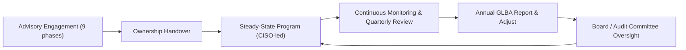
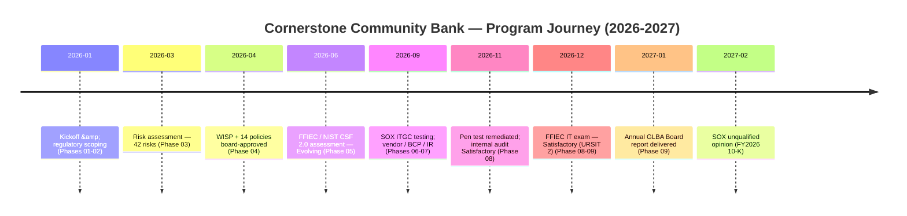

# 09.11 — Portfolio Closeout &amp; Transition

| Field | Value |
|---|---|
| Document ID | CCB-EXEC-CLOSE-2026-911 |
| Version | 1.0 |
| Date | 2026-06-15 |
| Classification | Confidential — Nonpublic Information (NPI) // Illustrative Portfolio Sample |
| Owner | David Okonkwo, President, Cornerstone Community Bank |
| Author | Advisory Team (Financial-Services GRC) |
| Status | Approved |

## Purpose

This document formally **closes the nine-phase Cornerstone Community Bank GLBA / FFIEC / SOX portfolio** and records the Bank's transition from program build to steady-state continuous operation. It is the capstone deliverable of the engagement. It summarizes what each of the nine phases delivered, confirms that the Bank is **compliant and well-managed** — evidenced by a Satisfactory FFIEC examination, an unqualified SOX opinion, and regulatory good standing — hands ownership to the enduring accountable roles, and marks the end of the advisory engagement with a dignified close. From here, the program is not a project but a permanent, governed function of the Bank.

## Portfolio Summary — Nine Phases

The engagement delivered a complete, examiner-ready information security and compliance program across nine sequenced phases, from regulatory foundation to Board reporting and continuous improvement.

| Phase | Title | Key Deliverable | Result |
|---|---|---|---|
| 01 | Program Foundation &amp; Regulatory Scoping | Regulatory register, scope, ADRs | Foundation set — GLBA/FFIEC/SOX/FDICIA mapped |
| 02 | Information Asset Inventory &amp; Data Classification | 140-system inventory; 22 NPI, 6 SOX-relevant | Assets and NPI located and classified |
| 03 | Risk Assessment (GLBA 501(b) + Inherent Risk) | 42 risks (8 High / 18 Moderate / 16 Low) | Moderate inherent profile, ranked &amp; owned |
| 04 | Information Security Program &amp; Control Design | WISP + 14 core policies; safeguards | Board-approved control framework |
| 05 | FFIEC Cybersecurity Assessment &amp; NIST CSF 2.0 | Current Evolving; 28-gap roadmap to Intermediate | Durable measurement spine established |
| 06 | SOX IT General Controls (ITGC) &amp; FDICIA | 48 key controls; 3 deficiencies (0 MW) remediated | ICFR effective; SOC 1 reliance on Meridian |
| 07 | Third-Party / Vendor Risk &amp; Business Continuity | 85 vendors, 12 critical; BCP/DR; IR + tabletop | Enhanced oversight; RTO/RPO met |
| 08 | Independent Testing, Audit &amp; Exam Readiness | Pen test (14 findings) remediated; internal audit | Satisfactory; findings closed |
| 09 | Board Reporting, Program Maturity &amp; Continuous Improvement | Annual GLBA report; dashboards; roadmap; closeout | Board assured; steady-state transition |

## Program Outcomes — Confirmation of Good Standing

The portfolio closes with the Bank in a demonstrably compliant and well-managed position, corroborated by four independent assurance providers.

| Outcome | Result | Source |
|---|---|---|
| FFIEC IT Examination | **Satisfactory — URSIT composite "2"** (report 2026-12-15) | FDIC / Ohio DFI |
| SOX 404(b) / FDICIA Part 363 | **Unqualified — ICFR effective, 0 material weaknesses** | Whitmore &amp; Associates, LLP |
| Independent Penetration Test | **14 findings — all remediated** | Redwood Security Partners, LLC |
| Internal Audit | **Satisfactory with recommendations** | Priya Sharma, Internal Audit |
| Annual GLBA Board Report | **Delivered** | Rachel Alvarez, CISO |
| Residual Risk Posture | **Low-to-Moderate, well-managed** | Enterprise assessment (09.06) |
| Program Maturity | **Evolving → Intermediate (funded 28-gap roadmap)** | CSF 2.0 assessment (09.04) |

Management asserts, and the independent evidence supports, that there is **no material weakness, no Matter Requiring Board Attention, no adverse audit opinion, and no unremediated high-severity finding** at portfolio close.

## Transition to Steady-State Operation

The advisory engagement ends; the program endures. Accountability transfers cleanly to the enduring roles that will run the program as a permanent function of the Bank, governed by the Board and Audit Committee through the established annual adjust-and-report loop.

| Enduring Function | Accountable Role | Ongoing Responsibility |
|---|---|---|
| Program ownership &amp; Board reporting | Rachel Alvarez (CISO) | WISP maintenance, annual GLBA report, roadmap execution |
| Security operations | Marcus Doyle (IT Sec Mgr) | Monitoring, vuln mgmt, access reviews, IR |
| Enterprise &amp; third-party risk | Steven Nakamura (CRO) | ERM integration, vendor oversight |
| ICFR / SOX | Linda Barrett (CFO) | Annual ICFR attestation, ITGC operation |
| Compliance &amp; privacy | Angela Foster / Karen Ellis | GLBA, Reg P, awareness |
| Independent assurance | Priya Sharma (Internal Audit) | Risk-based audit to the Audit Committee |
| Board oversight | Robert Hanley (Audit Committee Chair) | Governance, endorsement, challenge |

## The Journey — Capstone Timeline

## Closeout Attestation

| Attestation | Statement |
|---|---|
| Program completeness | All nine phases delivered; artifacts baselined and version-controlled |
| Compliance standing | GLBA Safeguards, Reg P, FFIEC, SOX 404, and FDICIA Part 363 obligations met |
| Independent validation | Satisfactory exam, unqualified SOX opinion, remediated testing |
| Residual posture | Low-to-Moderate, within Board-stated risk appetite |
| Forward plan | Funded 28-gap roadmap to Intermediate; emerging-risk watch active |
| Transition | Ownership vested in enduring roles; steady-state operation confirmed |

## Executive Sign-Off

Closeout is confirmed by the accountable executives and the Board's oversight body. Signatures are indicative for this illustrative portfolio.

| Role | Name | Closeout Confirmation |
|---|---|---|
| President, Cornerstone Community Bank | David Okonkwo | Program complete; Bank in good standing |
| Chief Information Security Officer / ISO | Rachel Alvarez | Program ownership accepted for steady-state |
| Chief Financial Officer | Linda Barrett | ICFR effective; SOX obligations met |
| Chief Risk Officer | Steven Nakamura | Residual posture within appetite |
| Audit Committee Chair | Robert Hanley | Board oversight satisfied; closeout endorsed |
| Advisory Team (Financial-Services GRC) | Advisory Team | Engagement delivered and handed over |

## What Continues After Closeout

Closeout ends the engagement, not the obligations. The following commitments run indefinitely under the Bank's own governance.

| Continuing Commitment | Cadence |
|---|---|
| Continuous monitoring (logging, vuln mgmt, access reviews) | Ongoing |
| Quarterly KPI/KRI and CSF 2.0 re-scoring to the Board | Quarterly |
| 28-gap roadmap execution to Intermediate | 12–24 months |
| Independent testing and internal audit | Annual |
| Annual GLBA Board report and adjust-and-report loop | Annual |
| Next FFIEC IT examination readiness | Next exam cycle |

## Capstone Statement

Cornerstone Community Bank set out to protect the nonpublic personal information of roughly 85,000 customers and to meet its obligations under GLBA, the FFIEC IT Handbook, SOX 404, and FDICIA Part 363. Over twelve months it built a risk-driven, board-sponsored program measured against NIST CSF 2.0, validated it through independent examination and audit, and emerged **compliant, well-managed, and in good standing.** The program now passes into the steady-state stewardship of the CISO and the enduring control functions, governed by the Board through an annual adjust-and-report loop, with a funded roadmap carrying the Bank from Evolving toward Intermediate maturity. The portfolio is hereby closed. The work of protecting the Bank and its customers continues — as it must, and now on a durable foundation.

## Cross-References

- `09.01-executive-summary.md` — program executive summary
- `09.02-annual-glba-board-report.md` — annual GLBA Board report
- `09.07-regulatory-exam-and-audit-outcomes.md` — consolidated assurance outcomes
- `09.09-continuous-improvement-roadmap.md` — forward roadmap into steady state
- `09.10-lessons-learned-retrospective.md` — engagement retrospective
- `../01-program-foundation-regulatory-scoping/` — where the journey began

[⬅ Previous](09.10-lessons-learned-retrospective.md) · [🏠 Phase README](09.00-README.md) · [🏠 Portfolio Home](../README.md)
