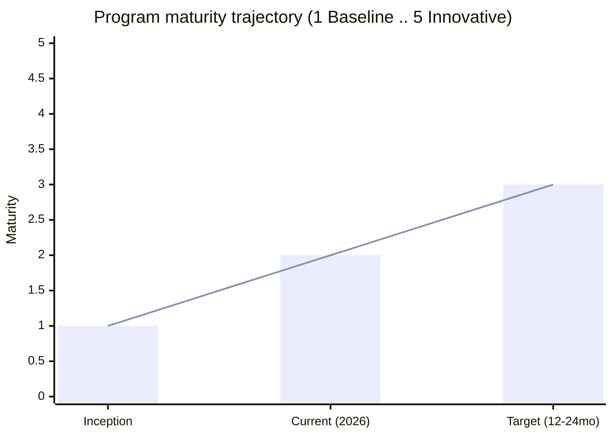

# Diagram — Maturity Trajectory

| Field | Value |
|---|---|
| Version | 1.0 |
| Date | 2026-06-15 |
| Classification | Confidential — Nonpublic Information (NPI) // Illustrative Portfolio Sample |
| Institution | Cornerstone Community Bank (parent: Cornerstone Bancorp, Inc. — Nasdaq: CCBK) |
| Regulators | FDIC · Ohio DFI · SEC |
| Phase | 09 — Board Reporting & Program Maturity |
| Author | Advisory Team (Financial-Services GRC) |
| Status | Approved |

Evolving today; **Intermediate** target as the 28-gap roadmap closes.

## Cross-References
`09.04-program-maturity-assessment.md`.
