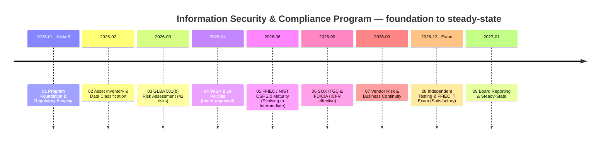
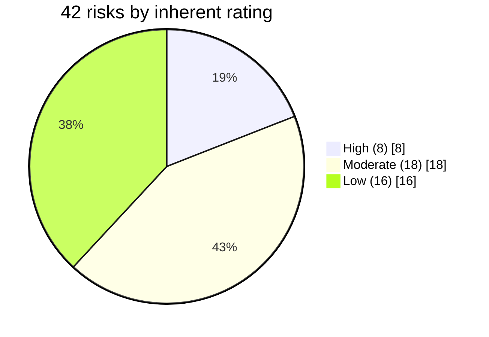
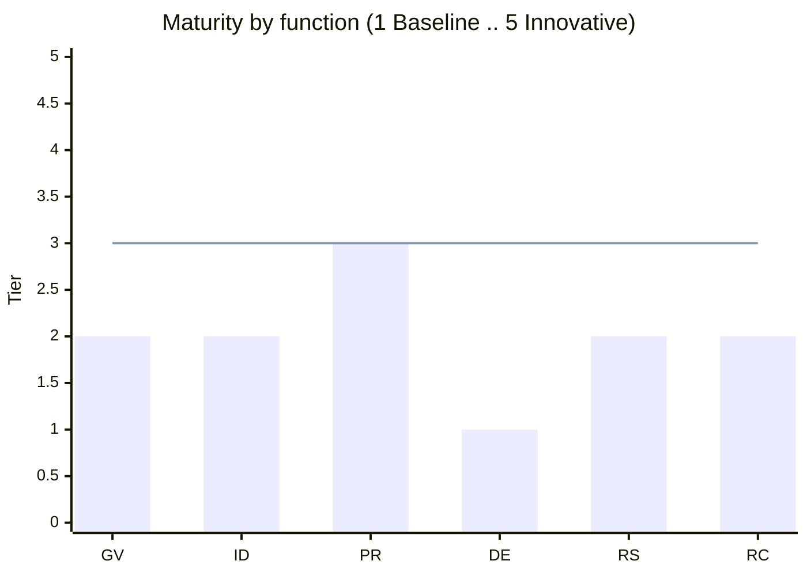
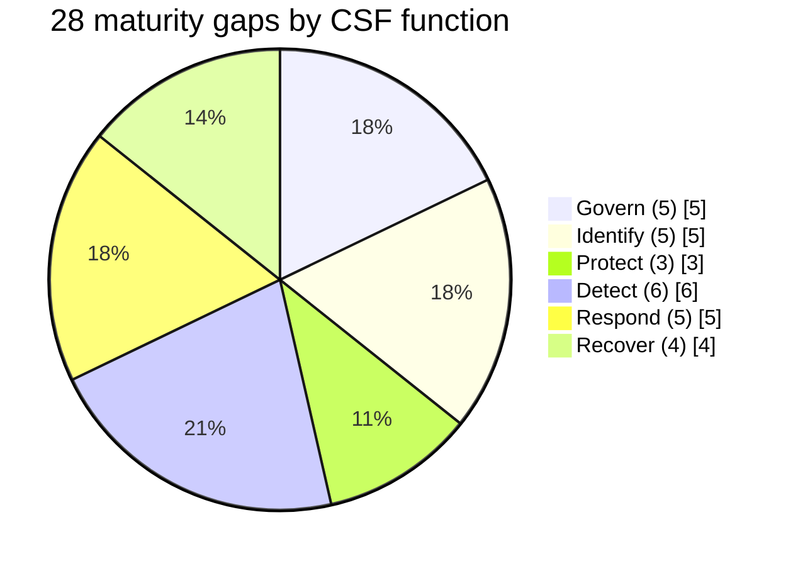
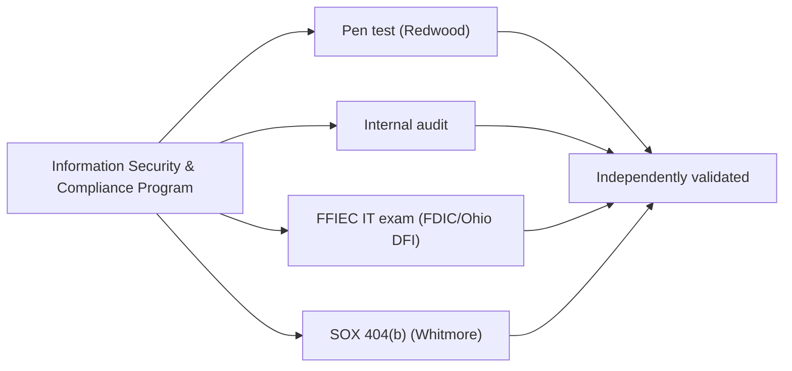
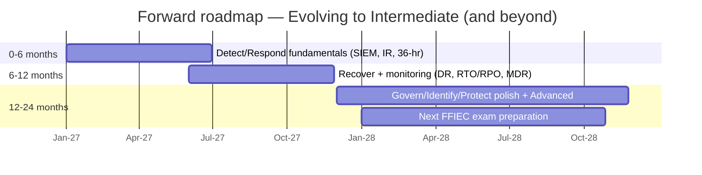

# 📊 Executive Dashboard — Cornerstone Community Bank Information Security & Compliance Program

> **This page renders directly on GitHub** — the charts below are [Mermaid](https://github.blog/2022-02-14-include-diagrams-markdown-files-mermaid/) diagrams that GitHub draws inline, so the dashboard is visible with no setup.
> For the fully interactive version (light/dark toggle, hover tooltips), open [`index.html`](index.html) locally or enable **GitHub Pages** (see the repo [README](../README.md)).
>
> *Illustrative portfolio sample · "Confidential — Nonpublic Information (NPI)" formatting for realism only · all names & figures fictional.*

---

## Program scorecard

| Dimension | Result | Status |
|---|---|:--:|
| **Institution** | Cornerstone Community Bank · Nasdaq parent CCBK · FDIC + Ohio DFI | 🟢 |
| **Frameworks** | GLBA §501(b) · Reg P · FFIEC · **NIST CSF 2.0** · SOX §404 · FDICIA 363 | 🟢 |
| **Risk** | 42 risks (8 High, all treated) · inherent **Moderate** · residual **Low-to-Moderate** | 🟢 |
| **Maturity (NIST CSF 2.0)** | Current **Evolving** → target **Intermediate** · 28-gap roadmap | 🟡 |
| **SOX ITGC** | 48 controls · 3 deficiencies remediated · **0 material weaknesses** · ICFR effective | 🟢 |
| **Third-party & resilience** | 85 vendors · Meridian enhanced oversight · BCP/DR tested · IR tabletop | 🟢 |
| **FFIEC IT examination** | **Satisfactory — URSIT composite "2"** (report 2026-12-15) | 🟢 |
| **Independent validation** | Pen test 14 findings remediated · internal audit Satisfactory · SOX 404(b) unqualified | 🟢 |

---

## The nine-phase journey

---

## Risk register — GLBA §501(b)

All **8 High risks** are treated by designed controls (Phase 04); FFIEC inherent risk profile is **Moderate**; residual posture is **Low-to-Moderate**.

---

## NIST CSF 2.0 maturity — 28 gaps to Intermediate

Bar = current tier · line = **Intermediate** target (Tier 3). Strongest: **Protect**. Weakest: **Detect / Respond / Recover**.

---

## SOX ITGC & independent validation

| Assurance lens | Provider | Result |
|---|---|:--:|
| SOX §404 ITGC (48 controls) | Internal Audit | 3 deficiencies (1 SD + 2 CD) · **0 material weaknesses** · remediated |
| SOX §404(b) attestation | Whitmore & Associates | **Unqualified** — ICFR effective |
| External penetration test | Redwood Security Partners | 14 findings (2H/6M/6L) · **all remediated** |
| Internal audit of program | Internal Audit | **Satisfactory** with recommendations |
| FFIEC IT examination | FDIC / Ohio DFI | **Satisfactory — URSIT composite "2"** |

---

## Executive KPIs / KRIs

| Metric | Actual | Target | Status |
|---|---|---|:--:|
| Patch SLA conformance | 96% | ≥95% | 🟢 |
| MFA coverage (privileged/remote) | 98% | 100% | 🟡 |
| Quarterly access reviews complete | 100% | 100% | 🟢 |
| Security-awareness training | 97% | ≥95% | 🟢 |
| Critical-vendor reviews current | 12/12 | 12/12 | 🟢 |
| Pen-test findings remediated | 14/14 | 100% | 🟢 |
| Reportable security incidents | 0 | 0 | 🟢 |
| Material weaknesses (ICFR) | 0 | 0 | 🟢 |

---

## Continuous-improvement roadmap (12–24 months)

Watch items: AI risk governance, evolving FFIEC guidance, quantum-safe cryptography.

---

## The nine phases

| Phase | Focus | Signature outcome |
|---|---|---|
| [01 Program Foundation](../01-program-foundation-regulatory-scoping/01.00-README.md) | Charter & scoping | Foundation baselined |
| [02 Asset Inventory & Classification](../02-asset-inventory-data-classification/02.00-README.md) | Inventory & NPI map | 22 NPI · 6 SOX systems |
| [03 Risk Assessment](../03-risk-assessment/03.00-README.md) | GLBA §501(b) | 42 risks · Moderate inherent |
| [04 Security Program & Controls](../04-information-security-program-controls/04.00-README.md) | WISP + 14 policies | 8 High risks treated |
| [05 FFIEC / NIST CSF 2.0](../05-ffiec-nist-csf-assessment/05.00-README.md) | Cyber maturity | Evolving → Intermediate · 28 gaps |
| [06 SOX ITGC & FDICIA](../06-sox-itgc-fdicia/06.00-README.md) | ITGC / ICFR | 0 material weaknesses |
| [07 Third-Party & Continuity](../07-third-party-risk-business-continuity/07.00-README.md) | Vendor risk & BCP/DR | Resilience tested |
| [08 Independent Testing & Exam](../08-independent-testing-audit-exam-readiness/08.00-README.md) | Validation | **Satisfactory (URSIT-2)** |
| [09 Board Reporting & Maturity](../09-board-reporting-program-maturity/09.00-README.md) | Synthesis | This dashboard |

---

*Prepared by the Advisory Team. Fictional illustrative portfolio sample — not a real bank or a real examination. Frameworks referenced: GLBA §501(b), Regulation P, the FFIEC IT Examination Handbook, NIST CSF 2.0, SOX §404, FDICIA Part 363.*

[⬅ Back to portfolio README](../README.md)
