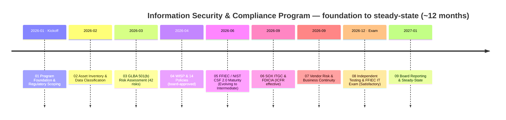
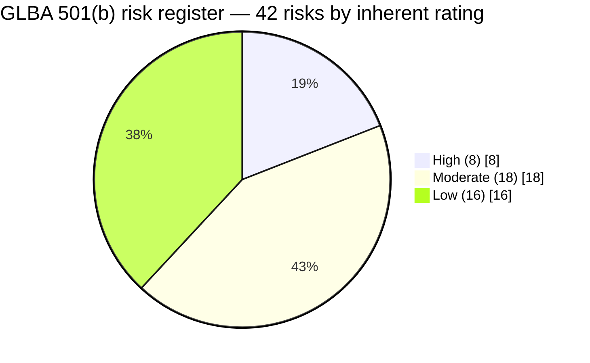

# Community Bank — GLBA / FFIEC / SOX Information Security & Compliance Program

### 📊 [**View the Executive Dashboard →**](docs/DASHBOARD.md) &nbsp;·&nbsp; 🗂️ [Jump to full repository map](#-repository-map--links-to-every-folder)

> An end-to-end, illustrative **information security & compliance program** for a fictitious community bank — **Cornerstone Community Bank** (a subsidiary of publicly traded **Cornerstone Bancorp, Inc.**, Nasdaq: **CCBK**) — taken from program foundation through a favorable **FFIEC IT examination** and steady-state operation. Regulated by the **FDIC** and the **Ohio Division of Financial Institutions**; core banking outsourced to **Meridian Core Services**.
>
> **All names, data, figures, and findings are fictional**, produced as a professional portfolio demonstration of financial-services GRC / information-security / SOX capability. Nothing here represents a real bank, a real system, or a real examination.

---

## Program at a glance

| Attribute | Value |
|---|---|
| Institution | **Cornerstone Community Bank** — state-chartered, FDIC-insured (Ohio) |
| Parent | **Cornerstone Bancorp, Inc.** — publicly traded (Nasdaq: CCBK) → SOX applies |
| Regulators | **FDIC** · **Ohio DFI** · **SEC** (parent) — FFIEC framework |
| Size | ~$1.2B assets · 18 branches · ~240 employees · ~85,000 customers |
| Frameworks | **GLBA §501(b)** · Reg P · FFIEC IT Handbook · **NIST CSF 2.0** · **SOX §404 ITGC** · FDICIA Part 363 |
| Data at stake | Customer **NPI** across 22 systems · 140 systems total · 6 SOX-significant |
| Risk | 42 risks (8 High, all treated) · FFIEC inherent risk **Moderate** · residual **Low-to-Moderate** |
| Maturity (NIST CSF 2.0) | Current **Evolving** → target **Intermediate** · 28-gap roadmap |
| SOX ITGC | 48 key controls · 3 deficiencies remediated · **0 material weaknesses** · ICFR effective |
| Independent validation | Pen test (14 findings, all remediated) · internal audit Satisfactory · **FFIEC IT exam Satisfactory (URSIT-2)** · unqualified SOX 404(b) |
| Scale | **9 phases · 130+ documents · 36 Excel trackers, diagrams, logs, 20 ADRs & templates** |

---

## 🗂️ Repository map — links to every folder

Each phase is a top-level folder containing a numbered document set (`NN.00`–`NN.NN`) in execution order, plus six artifact sub-folders. Click any cell to open that folder on GitHub.

| Phase | Overview | 🖼️ Diagrams | 📈 Trackers (Excel) | 📝 Logs | 🏛️ Governance | 🧭 ADRs | 📋 Templates |
|---|---|---|---|---|---|---|---|
| **01 — Program Foundation** | [README](01-program-foundation-regulatory-scoping/01.00-README.md) | [diagrams](01-program-foundation-regulatory-scoping/diagrams) | [trackers](01-program-foundation-regulatory-scoping/trackers) | [logs](01-program-foundation-regulatory-scoping/logs) | [governance](01-program-foundation-regulatory-scoping/governance) | [adr](01-program-foundation-regulatory-scoping/adr) | [templates](01-program-foundation-regulatory-scoping/templates) |
| **02 — Asset Inventory & Data Classification** | [README](02-asset-inventory-data-classification/02.00-README.md) | [diagrams](02-asset-inventory-data-classification/diagrams) | [trackers](02-asset-inventory-data-classification/trackers) | [logs](02-asset-inventory-data-classification/logs) | [governance](02-asset-inventory-data-classification/governance) | [adr](02-asset-inventory-data-classification/adr) | [templates](02-asset-inventory-data-classification/templates) |
| **03 — Risk Assessment** | [README](03-risk-assessment/03.00-README.md) | [diagrams](03-risk-assessment/diagrams) | [trackers](03-risk-assessment/trackers) | [logs](03-risk-assessment/logs) | [governance](03-risk-assessment/governance) | [adr](03-risk-assessment/adr) | [templates](03-risk-assessment/templates) |
| **04 — Information Security Program & Controls** | [README](04-information-security-program-controls/04.00-README.md) | [diagrams](04-information-security-program-controls/diagrams) | [trackers](04-information-security-program-controls/trackers) | [logs](04-information-security-program-controls/logs) | [governance](04-information-security-program-controls/governance) | [adr](04-information-security-program-controls/adr) | [templates](04-information-security-program-controls/templates) |
| **05 — FFIEC / NIST CSF 2.0 Assessment** | [README](05-ffiec-nist-csf-assessment/05.00-README.md) | [diagrams](05-ffiec-nist-csf-assessment/diagrams) | [trackers](05-ffiec-nist-csf-assessment/trackers) | [logs](05-ffiec-nist-csf-assessment/logs) | [governance](05-ffiec-nist-csf-assessment/governance) | [adr](05-ffiec-nist-csf-assessment/adr) | [templates](05-ffiec-nist-csf-assessment/templates) |
| **06 — SOX ITGC & FDICIA** | [README](06-sox-itgc-fdicia/06.00-README.md) | [diagrams](06-sox-itgc-fdicia/diagrams) | [trackers](06-sox-itgc-fdicia/trackers) | [logs](06-sox-itgc-fdicia/logs) | [governance](06-sox-itgc-fdicia/governance) | [adr](06-sox-itgc-fdicia/adr) | [templates](06-sox-itgc-fdicia/templates) |
| **07 — Third-Party Risk & Business Continuity** | [README](07-third-party-risk-business-continuity/07.00-README.md) | [diagrams](07-third-party-risk-business-continuity/diagrams) | [trackers](07-third-party-risk-business-continuity/trackers) | [logs](07-third-party-risk-business-continuity/logs) | [governance](07-third-party-risk-business-continuity/governance) | [adr](07-third-party-risk-business-continuity/adr) | [templates](07-third-party-risk-business-continuity/templates) |
| **08 — Independent Testing, Audit & Exam Readiness** | [README](08-independent-testing-audit-exam-readiness/08.00-README.md) | [diagrams](08-independent-testing-audit-exam-readiness/diagrams) | [trackers](08-independent-testing-audit-exam-readiness/trackers) | [logs](08-independent-testing-audit-exam-readiness/logs) | [governance](08-independent-testing-audit-exam-readiness/governance) | [adr](08-independent-testing-audit-exam-readiness/adr) | [templates](08-independent-testing-audit-exam-readiness/templates) |
| **09 — Board Reporting & Program Maturity** | [README](09-board-reporting-program-maturity/09.00-README.md) | [diagrams](09-board-reporting-program-maturity/diagrams) | [trackers](09-board-reporting-program-maturity/trackers) | [logs](09-board-reporting-program-maturity/logs) | [governance](09-board-reporting-program-maturity/governance) | [adr](09-board-reporting-program-maturity/adr) | [templates](09-board-reporting-program-maturity/templates) |

**Top-level:** [`docs/`](docs) (dashboard) · [`docs/DASHBOARD.md`](docs/DASHBOARD.md) (renders on GitHub) · [`docs/index.html`](docs/index.html) (interactive)

Every phase folder also contains: `CHANGELOG.md`, `STRUCTURE.md`, `MANIFEST.md` (SHA-256 checksums), and `install.sh`.

---

## ⭐ Marquee documents (jump straight to the highlights)

| Document | Phase | What it is |
|---|---|---|
| [Executive Summary](09-board-reporting-program-maturity/09.01-executive-summary.md) | 09 | The whole program in one page |
| [Annual GLBA Board Report](09-board-reporting-program-maturity/09.02-annual-glba-board-report.md) | 09 | The statutory §501(b) report to the Board |
| [FFIEC IT Examination Outcome](08-independent-testing-audit-exam-readiness/08.10-ffiec-it-examination-outcome.md) | 08 | Satisfactory — URSIT composite "2" |
| [Penetration Test Results](08-independent-testing-audit-exam-readiness/08.03-penetration-test-results.md) | 08 | 14 findings (2H/6M/6L), all remediated |
| [SOX Management Assertion & Sign-Off](06-sox-itgc-fdicia/06.12-management-assertion-and-signoff.md) | 06 | ICFR effective; unqualified 404(b) opinion |
| [SOX ITGC Test Results & Deficiencies](06-sox-itgc-fdicia/06.10-test-results-and-deficiencies.md) | 06 | 48 controls; 3 deficiencies; 0 material weaknesses |
| [NIST CSF 2.0 Maturity Gap Analysis](05-ffiec-nist-csf-assessment/05.11-maturity-gap-analysis.md) | 05 | The consolidated 28-gap register |
| [Written Information Security Program (WISP)](04-information-security-program-controls/04.01-written-information-security-program-wisp.md) | 04 | The keystone GLBA §501(b) program |
| [Control-to-Risk Traceability](04-information-security-program-controls/04.14-control-to-risk-traceability.md) | 04 | Proof every High risk is treated |
| [GLBA §501(b) Risk Assessment Report](03-risk-assessment/03.10-risk-assessment-report.md) | 03 | The statutory risk assessment |

---

## The nine phases

| Phase | Focus | Signature outcome |
|---|---|---|
| [01 Program Foundation & Regulatory Scoping](01-program-foundation-regulatory-scoping/01.00-README.md) | Charter, regulators, obligation register, governance | Program foundation baselined |
| [02 Asset Inventory & Data Classification](02-asset-inventory-data-classification/02.00-README.md) | 140 systems; NPI map; SOX scoping | 22 NPI systems · 6 SOX-significant |
| [03 Risk Assessment](03-risk-assessment/03.00-README.md) | GLBA §501(b) threats to NPI; FFIEC inherent risk | **42 risks** (8 High) · Moderate inherent |
| [04 Information Security Program & Controls](04-information-security-program-controls/04.00-README.md) | WISP + 14 policies; admin/tech/physical safeguards | 8 High risks treated |
| [05 FFIEC / NIST CSF 2.0 Assessment](05-ffiec-nist-csf-assessment/05.00-README.md) | Cyber maturity via NIST CSF 2.0 (CAT retired) | Evolving → Intermediate · **28 gaps** |
| [06 SOX ITGC & FDICIA](06-sox-itgc-fdicia/06.00-README.md) | ITGC over financial systems; SOC 1 reliance | **ICFR effective** · 0 material weaknesses |
| [07 Third-Party Risk & Business Continuity](07-third-party-risk-business-continuity/07.00-README.md) | 85 vendors; Meridian oversight; BCP/DR/IR | Resilience tested; 36-hour runbook |
| [08 Independent Testing, Audit & Exam Readiness](08-independent-testing-audit-exam-readiness/08.00-README.md) | Pen test, internal audit, FFIEC IT exam, SOX 404(b) | **Satisfactory (URSIT-2)** |
| [09 Board Reporting & Program Maturity](09-board-reporting-program-maturity/09.00-README.md) | Annual GLBA report, KPIs, roadmap, closeout | Compliant & well-managed |

---

## How each phase is organized

Every phase contains a numbered document set (`NN.00`–`NN.NN`) in the logical order a real engagement produces them, plus consulting artifacts:

- **`diagrams/`** — Mermaid architecture, process, and status diagrams
- **`trackers/`** — formatted, filterable Excel workbooks (inventories, risk register, gap register, ITGC matrix, KPIs)
- **`logs/`** — decision, risk, RAID, and action-item logs
- **`governance/`** — meeting minutes and board/committee reports
- **`adr/`** — Architecture / program Decision Records (numbered continuously across the portfolio, 0001–0020)
- **`templates/`** — reusable program templates

---

## Continuity threads (traceable across phases)

A single storyline traces cleanly across all nine phases — a risk discovered at assessment, treated by a control, matured, tested independently, and reported to the board:

- **Phishing / account takeover:** `R-01` (risk assessment) → phishing-resistant MFA + email security (Phase 04) → `PT-02` legacy-MFA bypass found & remediated (Phase 08) → KPI: MFA coverage (Phase 09).
- **Detect / Respond / Recover maturity:** 6+5+4 gaps (Phase 05) → SIEM, IR plan, DR test, 36-hour runbook (Phase 07) → exam recommendation to expand SIEM use cases (Phase 08) → roadmap (Phase 09).
- **Outsourced core (Meridian):** service-provider oversight (Phase 01) → SOC 1 reliance & CUECs (Phase 06) → enhanced vendor oversight & exit strategy (Phase 07) → residual concentration risk carried to the board (Phase 09).

---

## Key parties (all fictitious)

- **Bank:** Cornerstone Community Bank (`Cornerstone Bancorp, Inc.`, Nasdaq: CCBK) — President David Okonkwo, CISO/ISO Rachel Alvarez, CIO James Porter, CRO Steven Nakamura, CFO Linda Barrett, CCO Angela Foster, Privacy Officer Karen Ellis, IT Security Manager Marcus Doyle, Director of Internal Audit Priya Sharma, Audit Committee Chair Robert Hanley.
- **Regulators:** FDIC (primary federal), Ohio Division of Financial Institutions, SEC (parent).
- **Core provider:** Meridian Core Services, LLC (SOC 1 / SOC 2 Type II).
- **External auditor:** Whitmore & Associates, LLP · **Independent testing:** Redwood Security Partners, LLC.

## Standards referenced

GLBA §501(b) & the Interagency Guidelines · Regulation P · the FFIEC IT Examination Handbook · **NIST CSF 2.0** (the FFIEC CAT retired 2025-08-31) · SOX §404 · FDICIA Part 363 · the 2022 Computer-Security Incident Notification Rule (36-hour) · the 2023 Interagency Guidance on Third-Party Relationships · NIST SP 800-53r5, 800-30, 800-88 · CIS Controls v8.

---

*Illustrative portfolio sample — "Confidential — Nonpublic Information (NPI)" formatting used for realism only. Not a real bank or a real examination.*
